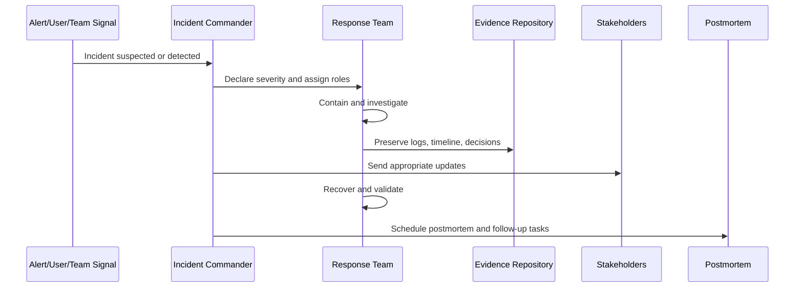

# Incident Response and Business Continuity Governance Overview

> *"Introduces CLARA's governance model for incidents, severity classification, response ownership, communications, recovery, postmortems, business continuity, disaster recovery, and evidence."*

---

# Purpose

Introduces CLARA's governance model for incidents, severity classification, response ownership, communications, recovery, postmortems, business continuity, disaster recovery, and evidence.

---

# Governance Problem

Incidents become more damaging when teams improvise roles, severity, communication, evidence collection, and recovery decisions during pressure.

---

# Governance Decision

## Decision

CLARA should govern incidents as controlled operational events with clear severity, ownership, containment, recovery, communication, evidence, and learning loops.

## Status

Accepted.

---

# Incident Governance Rule

Every CLARA incident must be governed as:

```text
Signal -> Declaration -> Severity -> Owner -> Containment -> Evidence -> Recovery -> Communication -> Postmortem -> Control Improvement
```

A serious incident is not complete until:

```text
impact is understood
recovery is verified
evidence is preserved
stakeholders are updated
follow-up actions are owned
risk/control updates are recorded
```

---

# Recommended Incident Flow



---

# Secure-by-Design Checklist

- [ ] Severity can be classified.
- [ ] Incident owner can be assigned.
- [ ] Containment path is known.
- [ ] Evidence preservation is defined.
- [ ] Customer/data impact assessment is defined.
- [ ] Communication boundary is defined.
- [ ] Recovery validation is defined.
- [ ] Postmortem requirement is defined.
- [ ] Follow-up task ownership is defined.
- [ ] Control improvement path is defined.

---

# Acceptance Criteria

- [ ] Incident process is clear.
- [ ] Severity model is clear.
- [ ] Ownership and escalation are clear.
- [ ] Evidence and communication rules are clear.
- [ ] Recovery and continuity expectations are clear.
- [ ] AI/integration/data incident variants are covered where relevant.
- [ ] AI coding assistants can follow this safely.

---

# Anti-patterns

Avoid:

- Debating severity forever instead of containing impact.
- Debugging before preserving evidence.
- Restarting systems and destroying useful logs without decision.
- Publicly communicating unverified root cause.
- Treating data/privacy incidents as normal bugs.
- Leaving incident communication to random chat.
- No postmortem for serious incidents.
- Postmortems with no owners or due dates.
- No continuity plan for critical workflows.
- Ignoring AI/integration-specific kill switches.

---

# Related Documents

- ../PART-02-Security-Policies-and-Standards/21-Incident-Response-Policy.md
- ../PART-03-Identity-and-Access-Governance/34-Emergency-Break-Glass-Access.md
- ../PART-05-AI-Governance-and-Model-Risk/59-AI-Incident-Handling-and-Kill-Switch-Governance.md
- ../PART-06-Integration-and-Third-Party-Governance/69-Third-Party-Incident-and-Outage-Governance.md
- ../PART-07-Audit-Evidence-and-Compliance-Readiness/README.md
- ../../BOOK-05-Engineering-Execution-Plan/PART-10-DevOps-and-Release-Execution/180-Incident-Response-Execution.md

---

# Navigation

**Previous:** `../PART-07-Audit-Evidence-and-Compliance-Readiness/84-Part-07-Summary.md`

**Next:** `86-Incident-Governance-Model.md`

---

# Incident Governance Scope

CLARA incident governance covers:

```text
security incidents
privacy/data incidents
availability incidents
performance degradation
failed deployments
database failures
AI failures
integration/provider failures
credential leaks
audit/logging failures
backup/restore failures
```

---

# Core Incident Questions

During an incident, CLARA must answer:

```text
What happened?
Who is leading response?
What is the severity?
What is the customer/data impact?
What is being contained?
What evidence must be preserved?
What communication is needed?
How do we recover?
How do we prevent recurrence?
```
