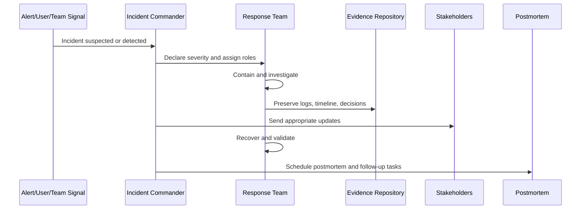

# Part 08 Summary

> *"Summarizes Incident Response and Business Continuity Governance and prepares for Book VI Part 09."*

---

# Purpose

Summarizes Incident Response and Business Continuity Governance and prepares for Book VI Part 09.

---

# Governance Problem

Secure SDLC governance comes next because incident learnings must feed back into development and release practices.

---

# Governance Decision

## Decision

CLARA should proceed to Secure SDLC Governance after incident response, severity, security incidents, reliability incidents, AI incidents, integration incidents, data breach response, communications, postmortems, and continuity governance are defined.

## Status

Accepted.

---

# Incident Governance Rule

Every CLARA incident must be governed as:

```text
Signal -> Declaration -> Severity -> Owner -> Containment -> Evidence -> Recovery -> Communication -> Postmortem -> Control Improvement
```

A serious incident is not complete until:

```text
impact is understood
recovery is verified
evidence is preserved
stakeholders are updated
follow-up actions are owned
risk/control updates are recorded
```

---

# Recommended Incident Flow



---

# Secure-by-Design Checklist

- [ ] Severity can be classified.
- [ ] Incident owner can be assigned.
- [ ] Containment path is known.
- [ ] Evidence preservation is defined.
- [ ] Customer/data impact assessment is defined.
- [ ] Communication boundary is defined.
- [ ] Recovery validation is defined.
- [ ] Postmortem requirement is defined.
- [ ] Follow-up task ownership is defined.
- [ ] Control improvement path is defined.

---

# Acceptance Criteria

- [ ] Incident process is clear.
- [ ] Severity model is clear.
- [ ] Ownership and escalation are clear.
- [ ] Evidence and communication rules are clear.
- [ ] Recovery and continuity expectations are clear.
- [ ] AI/integration/data incident variants are covered where relevant.
- [ ] AI coding assistants can follow this safely.

---

# Anti-patterns

Avoid:

- Debating severity forever instead of containing impact.
- Debugging before preserving evidence.
- Restarting systems and destroying useful logs without decision.
- Publicly communicating unverified root cause.
- Treating data/privacy incidents as normal bugs.
- Leaving incident communication to random chat.
- No postmortem for serious incidents.
- Postmortems with no owners or due dates.
- No continuity plan for critical workflows.
- Ignoring AI/integration-specific kill switches.

---

# Related Documents

- ../PART-02-Security-Policies-and-Standards/21-Incident-Response-Policy.md
- ../PART-03-Identity-and-Access-Governance/34-Emergency-Break-Glass-Access.md
- ../PART-05-AI-Governance-and-Model-Risk/59-AI-Incident-Handling-and-Kill-Switch-Governance.md
- ../PART-06-Integration-and-Third-Party-Governance/69-Third-Party-Incident-and-Outage-Governance.md
- ../PART-07-Audit-Evidence-and-Compliance-Readiness/README.md
- ../../BOOK-05-Engineering-Execution-Plan/PART-10-DevOps-and-Release-Execution/180-Incident-Response-Execution.md

---

# Navigation

**Previous:** `95-Business-Continuity-and-Disaster-Recovery-Governance.md`

**Next:** `../PART-09-Secure-SDLC-Governance/README.md`

---

# Part 08 Completion

Part 08 establishes:

- Incident Response and Business Continuity Governance overview.
- Incident governance model.
- Severity classification and escalation.
- Security incident response governance.
- Reliability and production incident governance.
- AI incident response governance.
- Integration and third-party incident governance.
- Data breach and privacy incident governance.
- Incident communication governance.
- Postmortem and learning governance.
- Business continuity and disaster recovery governance.

---

# Ready for Part 09

The next part should be:

```text
BOOK VI — PART 09: Secure SDLC Governance
```

It should define:

- Secure development lifecycle governance.
- Security requirements in planning.
- Threat modeling governance.
- Code review governance.
- Security testing governance.
- Dependency/supply-chain governance.
- Release security governance.
- Change management.
- Secure coding standards.
- SDLC evidence and metrics.
