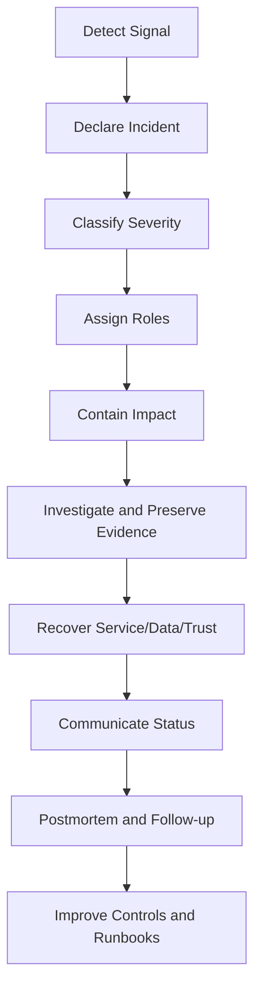

# PART-08 — Incident Response and Business Continuity Governance

> *"Incidents are not proof that the system failed forever. Incidents are the test of whether governance, recovery, and learning are real."*

---

# Purpose

Part 08 defines CLARA's governance model for incident response and business continuity.

It covers:

- Incident Response and Business Continuity Governance overview.
- Incident Governance Model.
- Severity Classification and Escalation.
- Security Incident Response Governance.
- Reliability and Production Incident Governance.
- AI Incident Response Governance.
- Integration and Third Party Incident Governance.
- Data Breach and Privacy Incident Governance.
- Incident Communication Governance.
- Postmortem and Learning Governance.
- Business Continuity and Disaster Recovery Governance.

---

# Chapter Map

| Chapter | Title |
|---:|---|
| 85 | Incident Response and Business Continuity Governance Overview |
| 86 | Incident Governance Model |
| 87 | Severity Classification and Escalation |
| 88 | Security Incident Response Governance |
| 89 | Reliability and Production Incident Governance |
| 90 | AI Incident Response Governance |
| 91 | Integration and Third Party Incident Governance |
| 92 | Data Breach and Privacy Incident Governance |
| 93 | Incident Communication Governance |
| 94 | Postmortem and Learning Governance |
| 95 | Business Continuity and Disaster Recovery Governance |
| 96 | Part 08 Summary |

---

# Incident Governance Map



---

# Governance Non-Negotiables

CLARA incident governance must enforce:

```text
clear severity classification
named incident commander for serious incidents
evidence preservation
fast containment
safe communication
customer/data impact assessment
AI and integration kill switches
credential rotation path
backup/restore readiness
postmortem for significant incidents
follow-up tasks with owners
business continuity planning
```

---

# Incident Categories

CLARA incidents may include:

```text
security incident
data/privacy incident
AI incident
integration/third-party incident
production reliability incident
deployment incident
database incident
credential incident
support/customer-impact incident
business continuity incident
```

---

# Relationship to Previous Parts

| Part | Contribution |
|---|---|
| Part 01 | Governance roles, risk, evidence |
| Part 02 | Incident Response Policy |
| Part 03 | Access evidence and emergency access |
| Part 04 | Data/privacy incident governance input |
| Part 05 | AI incident and kill switch governance input |
| Part 06 | Third-party incident governance input |
| Part 07 | Audit evidence and compliance readiness |

---

# Navigation

**Previous:** `../PART-07-Audit-Evidence-and-Compliance-Readiness/84-Part-07-Summary.md`

**Next:** `85-Incident-Response-and-Business-Continuity-Governance-Overview.md`
