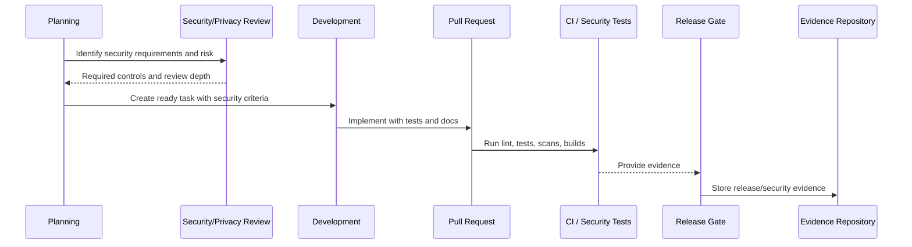

# Secure Coding Standards Governance

> *"Defines secure coding standards and governance expectations for backend, frontend, database, AI, integrations, and infrastructure code."*

---

# Purpose

Defines secure coding standards and governance expectations for backend, frontend, database, AI, integrations, and infrastructure code.

---

# Governance Problem

Inconsistent coding standards create inconsistent security posture across modules.

---

# Governance Decision

## Decision

CLARA secure coding standards should be simple, enforceable, reviewed, and mapped to common risks such as injection, XSS, SSRF, RCE, auth bypass, data leaks, and secret exposure.

## Status

Accepted.

---

# Secure SDLC Rule

Every meaningful CLARA change must be governed as:

```text
Requirement -> Risk Review -> Design/Threat Model -> Implementation -> Review -> Test -> Release Gate -> Evidence -> Learning
```

High-risk changes require stronger controls before merge and before production.

---

# Recommended SDLC Flow



---

# Secure-by-Design Checklist

- [ ] Security requirements are captured.
- [ ] Risk level is assigned.
- [ ] Threat modeling is done where needed.
- [ ] Secure coding standard is followed.
- [ ] Authorization/scoping is reviewed.
- [ ] Data/privacy impact is reviewed.
- [ ] AI/integration impact is reviewed where relevant.
- [ ] Security tests are defined.
- [ ] Release gate is defined.
- [ ] Evidence is retained.
- [ ] Incident/audit learnings are fed back.

---

# Acceptance Criteria

- [ ] SDLC step is clear.
- [ ] Governance owner is clear.
- [ ] Security review triggers are clear.
- [ ] Testing and evidence expectations are clear.
- [ ] Release and change control expectations are clear.
- [ ] AI coding assistants can follow this safely.

---

# Anti-patterns

Avoid:

- Security review only after code is done.
- Huge PRs with unclear risk.
- Frontend-only authorization.
- No cross-workspace test for scoped data.
- Adding dependencies without review.
- Ignoring secret scan findings.
- Shipping migrations without rollback/forward-fix plan.
- Emergency changes with no follow-up review.
- Incidents that do not produce SDLC improvements.
- AI-generated code merged without human review.

---

# Related Documents

- ../PART-02-Security-Policies-and-Standards/16-Secure-Development-Policy.md
- ../PART-08-Incident-Response-and-Business-Continuity-Governance/94-Postmortem-and-Learning-Governance.md
- ../../BOOK-05-Engineering-Execution-Plan/PART-02-Repository-and-Development-Workflow/README.md
- ../../BOOK-05-Engineering-Execution-Plan/PART-08-Security-Implementation-Plan/README.md
- ../../BOOK-05-Engineering-Execution-Plan/PART-09-Testing-and-QA-Execution/README.md
- ../../BOOK-05-Engineering-Execution-Plan/PART-10-DevOps-and-Release-Execution/README.md

---

# Navigation

**Previous:** `99-Threat-Modeling-Governance.md`

**Next:** `101-Code-Review-and-Approval-Governance.md`

---

# Secure Coding Standards

CLARA code should enforce:

```text
server-side authorization
input validation
safe output rendering
parameterized database queries
no unsafe dynamic execution
SSRF protection for outbound URLs
safe file handling
safe error responses
secret redaction
secure defaults
least privilege dependencies
```

---

# Backend Standards

```text
validate DTO/request payloads
scope queries by organization/workspace
centralize authorization helpers
avoid raw SQL unless reviewed
return safe error messages
audit sensitive actions
```

---

# Frontend Standards

```text
never trust frontend authorization alone
escape/render safely
avoid dangerouslySetInnerHTML unless reviewed
do not expose secrets in public env vars
handle loading/error/empty states safely
```
