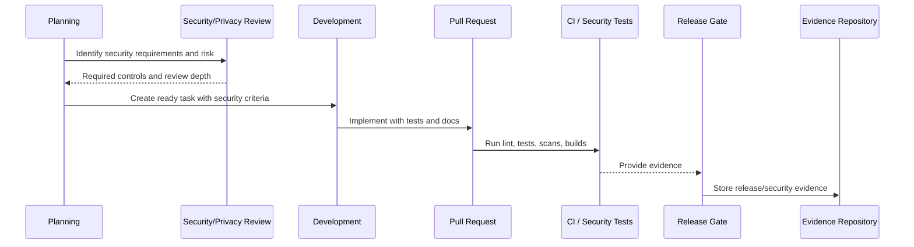

# Release Security Governance

> *"Defines security governance for release candidates, production readiness, feature flags, migrations, rollback, smoke tests, and release approval."*

---

# Purpose

Defines security governance for release candidates, production readiness, feature flags, migrations, rollback, smoke tests, and release approval.

---

# Governance Problem

A feature is not safe to release only because it compiles and passes basic tests.

---

# Governance Decision

## Decision

CLARA releases should pass security and operational gates before production exposure.

## Status

Accepted.

---

# Secure SDLC Rule

Every meaningful CLARA change must be governed as:

```text
Requirement -> Risk Review -> Design/Threat Model -> Implementation -> Review -> Test -> Release Gate -> Evidence -> Learning
```

High-risk changes require stronger controls before merge and before production.

---

# Recommended SDLC Flow



---

# Secure-by-Design Checklist

- [ ] Security requirements are captured.
- [ ] Risk level is assigned.
- [ ] Threat modeling is done where needed.
- [ ] Secure coding standard is followed.
- [ ] Authorization/scoping is reviewed.
- [ ] Data/privacy impact is reviewed.
- [ ] AI/integration impact is reviewed where relevant.
- [ ] Security tests are defined.
- [ ] Release gate is defined.
- [ ] Evidence is retained.
- [ ] Incident/audit learnings are fed back.

---

# Acceptance Criteria

- [ ] SDLC step is clear.
- [ ] Governance owner is clear.
- [ ] Security review triggers are clear.
- [ ] Testing and evidence expectations are clear.
- [ ] Release and change control expectations are clear.
- [ ] AI coding assistants can follow this safely.

---

# Anti-patterns

Avoid:

- Security review only after code is done.
- Huge PRs with unclear risk.
- Frontend-only authorization.
- No cross-workspace test for scoped data.
- Adding dependencies without review.
- Ignoring secret scan findings.
- Shipping migrations without rollback/forward-fix plan.
- Emergency changes with no follow-up review.
- Incidents that do not produce SDLC improvements.
- AI-generated code merged without human review.

---

# Related Documents

- ../PART-02-Security-Policies-and-Standards/16-Secure-Development-Policy.md
- ../PART-08-Incident-Response-and-Business-Continuity-Governance/94-Postmortem-and-Learning-Governance.md
- ../../BOOK-05-Engineering-Execution-Plan/PART-02-Repository-and-Development-Workflow/README.md
- ../../BOOK-05-Engineering-Execution-Plan/PART-08-Security-Implementation-Plan/README.md
- ../../BOOK-05-Engineering-Execution-Plan/PART-09-Testing-and-QA-Execution/README.md
- ../../BOOK-05-Engineering-Execution-Plan/PART-10-DevOps-and-Release-Execution/README.md

---

# Navigation

**Previous:** `103-Dependency-and-Supply-Chain-Governance.md`

**Next:** `105-Change-Management-and-Exception-Governance.md`

---

# Release Security Gates

Before release:

- [ ] CI passes.
- [ ] Security tests pass for changed areas.
- [ ] No known critical/high unaccepted security gap.
- [ ] Migrations reviewed.
- [ ] Secrets/config reviewed.
- [ ] Feature flags set for risky features.
- [ ] Rollback/disable path exists.
- [ ] Smoke tests pass in staging.
- [ ] Monitoring/alert impact reviewed.
- [ ] Release notes include security-relevant internal notes.

---

# High-Risk Release Rule

High-risk releases require explicit approval from accountable owner or security/governance owner.

---

# Emergency Release Rule

Emergency releases are allowed for containment, but require post-release review and evidence.
