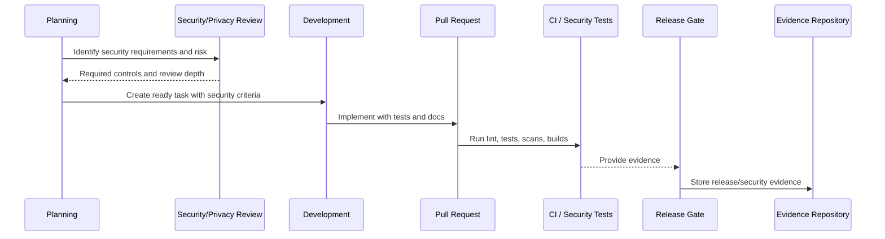

# Secure SDLC Metrics and Evidence

> *"Defines metrics and evidence that prove CLARA is operating a secure development lifecycle."*

---

# Purpose

Defines metrics and evidence that prove CLARA is operating a secure development lifecycle.

---

# Governance Problem

Without metrics and evidence, secure development becomes opinion rather than observable practice.

---

# Governance Decision

## Decision

CLARA should track practical SDLC evidence such as security tests, review coverage, vulnerability remediation, dependency status, release gates, and post-incident improvements.

## Status

Accepted.

---

# Secure SDLC Rule

Every meaningful CLARA change must be governed as:

```text
Requirement -> Risk Review -> Design/Threat Model -> Implementation -> Review -> Test -> Release Gate -> Evidence -> Learning
```

High-risk changes require stronger controls before merge and before production.

---

# Recommended SDLC Flow



---

# Secure-by-Design Checklist

- [ ] Security requirements are captured.
- [ ] Risk level is assigned.
- [ ] Threat modeling is done where needed.
- [ ] Secure coding standard is followed.
- [ ] Authorization/scoping is reviewed.
- [ ] Data/privacy impact is reviewed.
- [ ] AI/integration impact is reviewed where relevant.
- [ ] Security tests are defined.
- [ ] Release gate is defined.
- [ ] Evidence is retained.
- [ ] Incident/audit learnings are fed back.

---

# Acceptance Criteria

- [ ] SDLC step is clear.
- [ ] Governance owner is clear.
- [ ] Security review triggers are clear.
- [ ] Testing and evidence expectations are clear.
- [ ] Release and change control expectations are clear.
- [ ] AI coding assistants can follow this safely.

---

# Anti-patterns

Avoid:

- Security review only after code is done.
- Huge PRs with unclear risk.
- Frontend-only authorization.
- No cross-workspace test for scoped data.
- Adding dependencies without review.
- Ignoring secret scan findings.
- Shipping migrations without rollback/forward-fix plan.
- Emergency changes with no follow-up review.
- Incidents that do not produce SDLC improvements.
- AI-generated code merged without human review.

---

# Related Documents

- ../PART-02-Security-Policies-and-Standards/16-Secure-Development-Policy.md
- ../PART-08-Incident-Response-and-Business-Continuity-Governance/94-Postmortem-and-Learning-Governance.md
- ../../BOOK-05-Engineering-Execution-Plan/PART-02-Repository-and-Development-Workflow/README.md
- ../../BOOK-05-Engineering-Execution-Plan/PART-08-Security-Implementation-Plan/README.md
- ../../BOOK-05-Engineering-Execution-Plan/PART-09-Testing-and-QA-Execution/README.md
- ../../BOOK-05-Engineering-Execution-Plan/PART-10-DevOps-and-Release-Execution/README.md

---

# Navigation

**Previous:** `105-Change-Management-and-Exception-Governance.md`

**Next:** `107-Incident-Learning-into-SDLC.md`

---

# Secure SDLC Metrics

Track practical metrics:

```text
high-risk PRs reviewed
security tests added
authorization regression tests
dependency vulnerabilities open/closed
time to remediate critical/high issues
secret scan findings
security exceptions open/expired
release gate failures
postmortem action completion
```

---

# Evidence Sources

```text
PRs
CI results
test reports
security scan output
risk register
change records
release checklists
postmortems
dependency tickets
docs updates
```

---

# Metrics Rule

Metrics should drive improvement, not blame.
