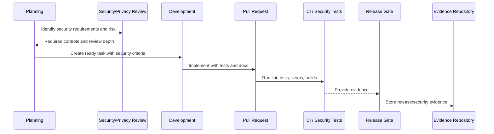

# Incident Learning into SDLC

> *"Defines how incidents, postmortems, vulnerabilities, customer reviews, and audits feed back into planning, coding standards, tests, and controls."*

---

# Purpose

Defines how incidents, postmortems, vulnerabilities, customer reviews, and audits feed back into planning, coding standards, tests, and controls.

---

# Governance Problem

If incidents do not improve the SDLC, the same failures will return.

---

# Governance Decision

## Decision

CLARA should convert incident learnings into backlog items, tests, runbook updates, policy updates, and SDLC improvements.

## Status

Accepted.

---

# Secure SDLC Rule

Every meaningful CLARA change must be governed as:

```text
Requirement -> Risk Review -> Design/Threat Model -> Implementation -> Review -> Test -> Release Gate -> Evidence -> Learning
```

High-risk changes require stronger controls before merge and before production.

---

# Recommended SDLC Flow



---

# Secure-by-Design Checklist

- [ ] Security requirements are captured.
- [ ] Risk level is assigned.
- [ ] Threat modeling is done where needed.
- [ ] Secure coding standard is followed.
- [ ] Authorization/scoping is reviewed.
- [ ] Data/privacy impact is reviewed.
- [ ] AI/integration impact is reviewed where relevant.
- [ ] Security tests are defined.
- [ ] Release gate is defined.
- [ ] Evidence is retained.
- [ ] Incident/audit learnings are fed back.

---

# Acceptance Criteria

- [ ] SDLC step is clear.
- [ ] Governance owner is clear.
- [ ] Security review triggers are clear.
- [ ] Testing and evidence expectations are clear.
- [ ] Release and change control expectations are clear.
- [ ] AI coding assistants can follow this safely.

---

# Anti-patterns

Avoid:

- Security review only after code is done.
- Huge PRs with unclear risk.
- Frontend-only authorization.
- No cross-workspace test for scoped data.
- Adding dependencies without review.
- Ignoring secret scan findings.
- Shipping migrations without rollback/forward-fix plan.
- Emergency changes with no follow-up review.
- Incidents that do not produce SDLC improvements.
- AI-generated code merged without human review.

---

# Related Documents

- ../PART-02-Security-Policies-and-Standards/16-Secure-Development-Policy.md
- ../PART-08-Incident-Response-and-Business-Continuity-Governance/94-Postmortem-and-Learning-Governance.md
- ../../BOOK-05-Engineering-Execution-Plan/PART-02-Repository-and-Development-Workflow/README.md
- ../../BOOK-05-Engineering-Execution-Plan/PART-08-Security-Implementation-Plan/README.md
- ../../BOOK-05-Engineering-Execution-Plan/PART-09-Testing-and-QA-Execution/README.md
- ../../BOOK-05-Engineering-Execution-Plan/PART-10-DevOps-and-Release-Execution/README.md

---

# Navigation

**Previous:** `106-Secure-SDLC-Metrics-and-Evidence.md`

**Next:** `108-Part-09-Summary.md`

---

# Learning Sources

Feed SDLC from:

```text
incidents
near misses
security bugs
audit gaps
customer security reviews
AI eval failures
integration failures
dependency vulnerabilities
production reliability postmortems
```

---

# Learning Output

Every meaningful learning should create one or more:

```text
new test
new checklist item
new runbook step
new coding standard
new policy clarification
new monitoring alert
new backlog task
new training note
```

---

# Learning Rule

If the same incident repeats, the previous corrective action was incomplete.
