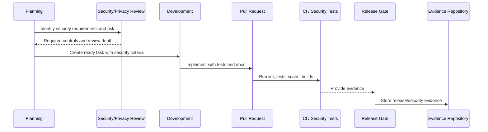

# Part 09 Summary

> *"Summarizes Secure SDLC Governance and prepares for Book VI Part 10."*

---

# Purpose

Summarizes Secure SDLC Governance and prepares for Book VI Part 10.

---

# Governance Problem

Risk register and control mapping come next because Secure SDLC controls need to be mapped, tracked, reviewed, and evidenced.

---

# Governance Decision

## Decision

CLARA should proceed to Risk Register and Control Mapping after secure planning, threat modeling, coding standards, code review, security testing, supply-chain governance, release governance, change management, SDLC metrics, and incident learning are defined.

## Status

Accepted.

---

# Secure SDLC Rule

Every meaningful CLARA change must be governed as:

```text
Requirement -> Risk Review -> Design/Threat Model -> Implementation -> Review -> Test -> Release Gate -> Evidence -> Learning
```

High-risk changes require stronger controls before merge and before production.

---

# Recommended SDLC Flow



---

# Secure-by-Design Checklist

- [ ] Security requirements are captured.
- [ ] Risk level is assigned.
- [ ] Threat modeling is done where needed.
- [ ] Secure coding standard is followed.
- [ ] Authorization/scoping is reviewed.
- [ ] Data/privacy impact is reviewed.
- [ ] AI/integration impact is reviewed where relevant.
- [ ] Security tests are defined.
- [ ] Release gate is defined.
- [ ] Evidence is retained.
- [ ] Incident/audit learnings are fed back.

---

# Acceptance Criteria

- [ ] SDLC step is clear.
- [ ] Governance owner is clear.
- [ ] Security review triggers are clear.
- [ ] Testing and evidence expectations are clear.
- [ ] Release and change control expectations are clear.
- [ ] AI coding assistants can follow this safely.

---

# Anti-patterns

Avoid:

- Security review only after code is done.
- Huge PRs with unclear risk.
- Frontend-only authorization.
- No cross-workspace test for scoped data.
- Adding dependencies without review.
- Ignoring secret scan findings.
- Shipping migrations without rollback/forward-fix plan.
- Emergency changes with no follow-up review.
- Incidents that do not produce SDLC improvements.
- AI-generated code merged without human review.

---

# Related Documents

- ../PART-02-Security-Policies-and-Standards/16-Secure-Development-Policy.md
- ../PART-08-Incident-Response-and-Business-Continuity-Governance/94-Postmortem-and-Learning-Governance.md
- ../../BOOK-05-Engineering-Execution-Plan/PART-02-Repository-and-Development-Workflow/README.md
- ../../BOOK-05-Engineering-Execution-Plan/PART-08-Security-Implementation-Plan/README.md
- ../../BOOK-05-Engineering-Execution-Plan/PART-09-Testing-and-QA-Execution/README.md
- ../../BOOK-05-Engineering-Execution-Plan/PART-10-DevOps-and-Release-Execution/README.md

---

# Navigation

**Previous:** `107-Incident-Learning-into-SDLC.md`

**Next:** `../PART-10-Risk-Register-and-Control-Mapping/README.md`

---

# Part 09 Completion

Part 09 establishes:

- Secure SDLC governance overview.
- Security requirements in planning.
- Threat modeling governance.
- Secure coding standards governance.
- Code review and approval governance.
- Security testing governance.
- Dependency and supply-chain governance.
- Release security governance.
- Change management and exception governance.
- Secure SDLC metrics and evidence.
- Incident learning into SDLC.

---

# Ready for Part 10

The next part should be:

```text
BOOK VI — PART 10: Risk Register and Control Mapping
```

It should define:

- Risk register structure.
- Control library.
- Control ownership.
- Risk-to-control mapping.
- Control maturity model.
- Residual risk tracking.
- Risk acceptance records.
- Control evidence mapping.
- Governance dashboard.
- Risk review cadence.
