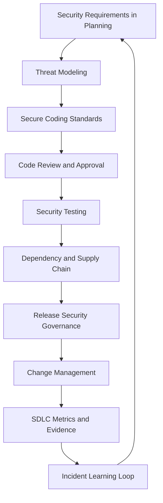

# PART-09 — Secure SDLC Governance

> *"Secure software is not created by a final checklist. It is created by secure decisions repeated across the lifecycle."*

---

# Purpose

Part 09 defines CLARA's Secure Software Development Lifecycle governance.

It covers:

- Secure SDLC Governance overview.
- Security Requirements in Planning.
- Threat Modeling Governance.
- Secure Coding Standards Governance.
- Code Review and Approval Governance.
- Security Testing Governance.
- Dependency and Supply Chain Governance.
- Release Security Governance.
- Change Management and Exception Governance.
- Secure SDLC Metrics and Evidence.
- Incident Learning into SDLC.

---

# Chapter Map

| Chapter | Title |
|---:|---|
| 97 | Secure SDLC Governance Overview |
| 98 | Security Requirements in Planning |
| 99 | Threat Modeling Governance |
| 100 | Secure Coding Standards Governance |
| 101 | Code Review and Approval Governance |
| 102 | Security Testing Governance |
| 103 | Dependency and Supply Chain Governance |
| 104 | Release Security Governance |
| 105 | Change Management and Exception Governance |
| 106 | Secure SDLC Metrics and Evidence |
| 107 | Incident Learning into SDLC |
| 108 | Part 09 Summary |

---

# Secure SDLC Governance Map



---

# Governance Non-Negotiables

CLARA Secure SDLC must enforce:

```text
security requirements before implementation
threat modeling for high-risk changes
server-side authorization review
tenant/workspace isolation review
secure coding standards
security review triggers
risk-based security tests
dependency and secret scanning where practical
release security gates
change traceability
incident learnings converted to controls/tests
SDLC evidence retention
```

---

# Relationship to Previous Parts

| Part | Contribution |
|---|---|
| Part 01 | Governance operating model |
| Part 02 | Secure Development Policy |
| Part 03 | Access governance requirements |
| Part 04 | Data/privacy requirements |
| Part 05 | AI governance requirements |
| Part 06 | Integration/third-party requirements |
| Part 07 | Evidence and compliance readiness |
| Part 08 | Incident learning input |
| Part 09 | Secure development lifecycle governance |

---

# Navigation

**Previous:** `../PART-08-Incident-Response-and-Business-Continuity-Governance/96-Part-08-Summary.md`

**Next:** `97-Secure-SDLC-Governance-Overview.md`
