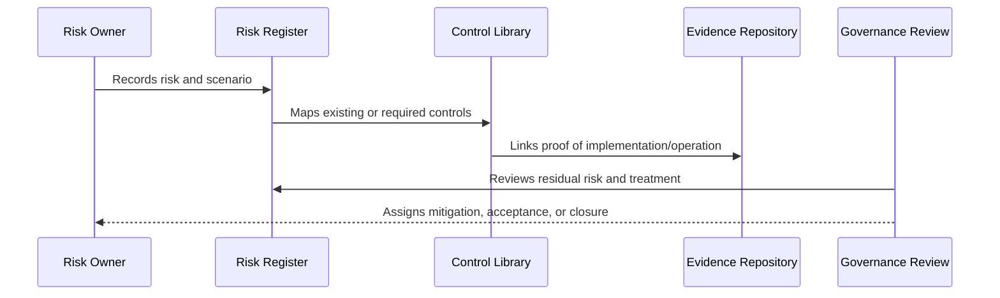

# Risk Register Structure

> *"Defines the required structure and fields for CLARA's risk register."*

---

# Purpose

Defines the required structure and fields for CLARA's risk register.

---

# Governance Problem

Risk records that lack owner, impact, mitigation, and review date are hard to act on.

---

# Governance Decision

## Decision

Every CLARA risk should have an ID, owner, category, scenario, asset, likelihood, impact, severity, mitigation, residual risk, status, review date, and evidence link.

## Status

Accepted.

---

# Risk and Control Rule

Every material CLARA risk must be governed as:

```text
Risk -> Owner -> Category -> Likelihood -> Impact -> Controls -> Residual Risk -> Treatment -> Evidence -> Review
```

Every important control must be governed as:

```text
Control -> Owner -> Requirement -> Implementation -> Evidence -> Maturity -> Review Cadence
```

---

# Recommended Governance Flow



---

# Secure-by-Design Checklist

- [ ] Risk owner is defined.
- [ ] Risk category is assigned.
- [ ] Likelihood and impact are assessed.
- [ ] Affected assets/data are identified.
- [ ] Controls are mapped.
- [ ] Residual risk is assessed.
- [ ] Treatment decision is recorded.
- [ ] Acceptance approval exists where needed.
- [ ] Evidence is linked.
- [ ] Review cadence is defined.

---

# Acceptance Criteria

- [ ] Risk structure is clear.
- [ ] Control structure is clear.
- [ ] Mapping process is clear.
- [ ] Evidence expectations are clear.
- [ ] Review cadence is clear.
- [ ] Dashboard/reporting expectations are clear.
- [ ] AI coding assistants can follow this safely.

---

# Anti-patterns

Avoid:

- Risk records with no owner.
- Risks tracked only in chat.
- Controls with no evidence.
- Accepting risk without approver.
- Closing risks without validation.
- Treating all risks as equal.
- Ignoring residual risk.
- Stale risk register.
- Control library disconnected from implementation.
- Reporting only green status while gaps are hidden.

---

# Related Documents

- ../PART-01-Security-Governance-Foundation/05-Risk-Management-Framework.md
- ../PART-07-Audit-Evidence-and-Compliance-Readiness/75-Control-to-Evidence-Mapping.md
- ../PART-09-Secure-SDLC-Governance/106-Secure-SDLC-Metrics-and-Evidence.md
- ../../BOOK-05-Engineering-Execution-Plan/PART-08-Security-Implementation-Plan/README.md

---

# Navigation

**Previous:** `109-Risk-Register-and-Control-Mapping-Overview.md`

**Next:** `111-Risk-Taxonomy-and-Categories.md`

---

# Risk Register Fields

Required fields:

```text
risk_id
title
description
category
asset/data affected
scenario
likelihood
impact
severity
owner
status
existing controls
planned controls
residual risk
treatment decision
accepted by
review date
evidence links
created date
updated date
```

---

# Example Risk Record

```markdown
## RISK-001 — Cross-workspace customer data exposure

Category: Identity / Tenant Isolation
Asset: Customer profiles and conversations
Likelihood: Medium
Impact: High
Severity: High
Owner: Backend/Security Owner
Existing Controls: Workspace-scoped queries, RBAC tests
Planned Controls: Additional cross-scope E2E tests
Residual Risk: Medium
Treatment: Mitigate
Review Date: Monthly
Evidence: test reports, PR links, audit logs
```
