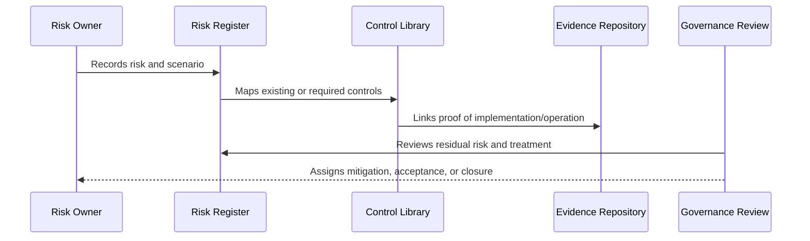

# Risk Taxonomy and Categories

> *"Defines CLARA's risk categories across identity, access, data, AI, integrations, application security, infrastructure, operations, compliance, and business continuity."*

---

# Purpose

Defines CLARA's risk categories across identity, access, data, AI, integrations, application security, infrastructure, operations, compliance, and business continuity.

---

# Governance Problem

Inconsistent risk labels make reporting and prioritization messy.

---

# Governance Decision

## Decision

CLARA should use consistent risk categories so risks can be grouped, prioritized, reported, and reviewed.

## Status

Accepted.

---

# Risk and Control Rule

Every material CLARA risk must be governed as:

```text
Risk -> Owner -> Category -> Likelihood -> Impact -> Controls -> Residual Risk -> Treatment -> Evidence -> Review
```

Every important control must be governed as:

```text
Control -> Owner -> Requirement -> Implementation -> Evidence -> Maturity -> Review Cadence
```

---

# Recommended Governance Flow



---

# Secure-by-Design Checklist

- [ ] Risk owner is defined.
- [ ] Risk category is assigned.
- [ ] Likelihood and impact are assessed.
- [ ] Affected assets/data are identified.
- [ ] Controls are mapped.
- [ ] Residual risk is assessed.
- [ ] Treatment decision is recorded.
- [ ] Acceptance approval exists where needed.
- [ ] Evidence is linked.
- [ ] Review cadence is defined.

---

# Acceptance Criteria

- [ ] Risk structure is clear.
- [ ] Control structure is clear.
- [ ] Mapping process is clear.
- [ ] Evidence expectations are clear.
- [ ] Review cadence is clear.
- [ ] Dashboard/reporting expectations are clear.
- [ ] AI coding assistants can follow this safely.

---

# Anti-patterns

Avoid:

- Risk records with no owner.
- Risks tracked only in chat.
- Controls with no evidence.
- Accepting risk without approver.
- Closing risks without validation.
- Treating all risks as equal.
- Ignoring residual risk.
- Stale risk register.
- Control library disconnected from implementation.
- Reporting only green status while gaps are hidden.

---

# Related Documents

- ../PART-01-Security-Governance-Foundation/05-Risk-Management-Framework.md
- ../PART-07-Audit-Evidence-and-Compliance-Readiness/75-Control-to-Evidence-Mapping.md
- ../PART-09-Secure-SDLC-Governance/106-Secure-SDLC-Metrics-and-Evidence.md
- ../../BOOK-05-Engineering-Execution-Plan/PART-08-Security-Implementation-Plan/README.md

---

# Navigation

**Previous:** `110-Risk-Register-Structure.md`

**Next:** `112-Control-Library-Structure.md`

---

# Risk Categories

Use consistent categories:

```text
identity_access
tenant_isolation
data_privacy
ai_model_risk
integration_third_party
application_security
infrastructure_devops
secure_sdlc
incident_response
business_continuity
compliance_readiness
vendor_risk
operational_process
```

---

# Risk Severity Matrix

| Impact \ Likelihood | Low | Medium | High |
|---|---|---|---|
| Low | Low | Low | Medium |
| Medium | Low | Medium | High |
| High | Medium | High | Critical |

---

# Category Rule

A risk can have a primary category and optional secondary categories.
