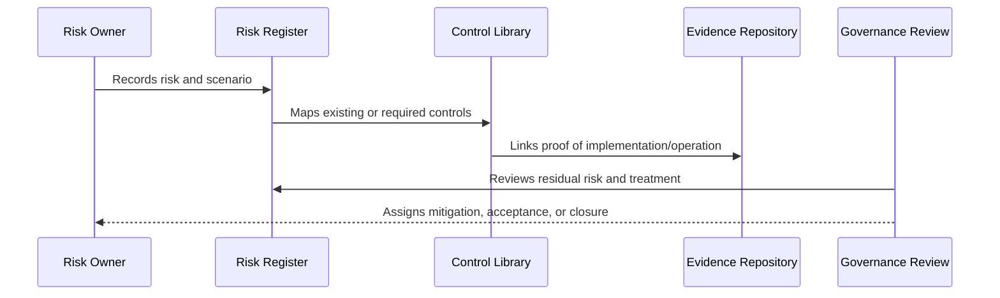

# Control Library Structure

> *"Defines CLARA's control library format, control IDs, ownership, implementation references, evidence, and review cadence."*

---

# Purpose

Defines CLARA's control library format, control IDs, ownership, implementation references, evidence, and review cadence.

---

# Governance Problem

Controls that are not defined consistently cannot be tested, audited, or improved.

---

# Governance Decision

## Decision

CLARA controls should be reusable, owner-assigned, mapped to implementation, and linked to evidence.

## Status

Accepted.

---

# Risk and Control Rule

Every material CLARA risk must be governed as:

```text
Risk -> Owner -> Category -> Likelihood -> Impact -> Controls -> Residual Risk -> Treatment -> Evidence -> Review
```

Every important control must be governed as:

```text
Control -> Owner -> Requirement -> Implementation -> Evidence -> Maturity -> Review Cadence
```

---

# Recommended Governance Flow



---

# Secure-by-Design Checklist

- [ ] Risk owner is defined.
- [ ] Risk category is assigned.
- [ ] Likelihood and impact are assessed.
- [ ] Affected assets/data are identified.
- [ ] Controls are mapped.
- [ ] Residual risk is assessed.
- [ ] Treatment decision is recorded.
- [ ] Acceptance approval exists where needed.
- [ ] Evidence is linked.
- [ ] Review cadence is defined.

---

# Acceptance Criteria

- [ ] Risk structure is clear.
- [ ] Control structure is clear.
- [ ] Mapping process is clear.
- [ ] Evidence expectations are clear.
- [ ] Review cadence is clear.
- [ ] Dashboard/reporting expectations are clear.
- [ ] AI coding assistants can follow this safely.

---

# Anti-patterns

Avoid:

- Risk records with no owner.
- Risks tracked only in chat.
- Controls with no evidence.
- Accepting risk without approver.
- Closing risks without validation.
- Treating all risks as equal.
- Ignoring residual risk.
- Stale risk register.
- Control library disconnected from implementation.
- Reporting only green status while gaps are hidden.

---

# Related Documents

- ../PART-01-Security-Governance-Foundation/05-Risk-Management-Framework.md
- ../PART-07-Audit-Evidence-and-Compliance-Readiness/75-Control-to-Evidence-Mapping.md
- ../PART-09-Secure-SDLC-Governance/106-Secure-SDLC-Metrics-and-Evidence.md
- ../../BOOK-05-Engineering-Execution-Plan/PART-08-Security-Implementation-Plan/README.md

---

# Navigation

**Previous:** `111-Risk-Taxonomy-and-Categories.md`

**Next:** `113-Risk-to-Control-Mapping.md`

---

# Control Library Fields

Required fields:

```text
control_id
control_name
category
requirement
owner
implementation reference
related policy
related risks
evidence source
test coverage
review cadence
maturity level
status
```

---

# Example Control

```markdown
## CTRL-001 — Workspace Scoped Authorization

Category: Identity / Tenant Isolation
Requirement: Workspace resources must only be accessible to authorized workspace members.
Owner: Backend/Security Owner
Implementation: Backend RBAC helper + scoped queries
Evidence: unit tests, API tests, PR reviews
Review Cadence: Per release + quarterly
Maturity: Managed
```

---

# Control ID Pattern

Use:

```text
CLARA-CTRL-001
CLARA-CTRL-002
```
