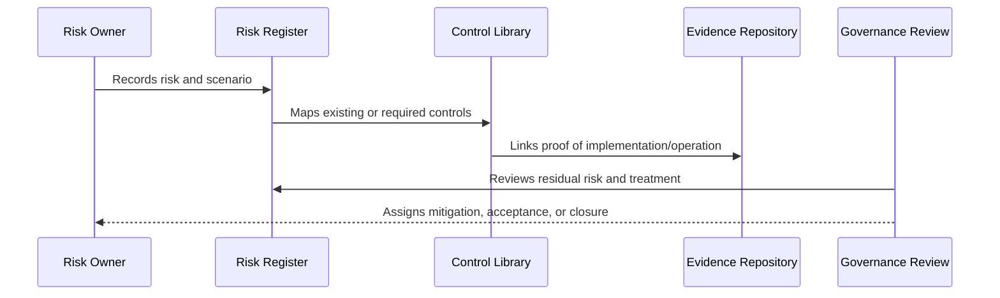

# Risk to Control Mapping

> *"Defines how risks are mapped to preventive, detective, corrective, and compensating controls."*

---

# Purpose

Defines how risks are mapped to preventive, detective, corrective, and compensating controls.

---

# Governance Problem

A risk without mapped controls is only documented, not managed.

---

# Governance Decision

## Decision

Every material CLARA risk should map to one or more controls that reduce likelihood, reduce impact, detect failure, or support recovery.

## Status

Accepted.

---

# Risk and Control Rule

Every material CLARA risk must be governed as:

```text
Risk -> Owner -> Category -> Likelihood -> Impact -> Controls -> Residual Risk -> Treatment -> Evidence -> Review
```

Every important control must be governed as:

```text
Control -> Owner -> Requirement -> Implementation -> Evidence -> Maturity -> Review Cadence
```

---

# Recommended Governance Flow



---

# Secure-by-Design Checklist

- [ ] Risk owner is defined.
- [ ] Risk category is assigned.
- [ ] Likelihood and impact are assessed.
- [ ] Affected assets/data are identified.
- [ ] Controls are mapped.
- [ ] Residual risk is assessed.
- [ ] Treatment decision is recorded.
- [ ] Acceptance approval exists where needed.
- [ ] Evidence is linked.
- [ ] Review cadence is defined.

---

# Acceptance Criteria

- [ ] Risk structure is clear.
- [ ] Control structure is clear.
- [ ] Mapping process is clear.
- [ ] Evidence expectations are clear.
- [ ] Review cadence is clear.
- [ ] Dashboard/reporting expectations are clear.
- [ ] AI coding assistants can follow this safely.

---

# Anti-patterns

Avoid:

- Risk records with no owner.
- Risks tracked only in chat.
- Controls with no evidence.
- Accepting risk without approver.
- Closing risks without validation.
- Treating all risks as equal.
- Ignoring residual risk.
- Stale risk register.
- Control library disconnected from implementation.
- Reporting only green status while gaps are hidden.

---

# Related Documents

- ../PART-01-Security-Governance-Foundation/05-Risk-Management-Framework.md
- ../PART-07-Audit-Evidence-and-Compliance-Readiness/75-Control-to-Evidence-Mapping.md
- ../PART-09-Secure-SDLC-Governance/106-Secure-SDLC-Metrics-and-Evidence.md
- ../../BOOK-05-Engineering-Execution-Plan/PART-08-Security-Implementation-Plan/README.md

---

# Navigation

**Previous:** `112-Control-Library-Structure.md`

**Next:** `114-Control-Ownership-and-Maturity-Model.md`

---

# Control Types

Map risks to control types:

| Type | Purpose | Example |
|---|---|---|
| Preventive | Prevent issue | RBAC check |
| Detective | Detect issue | alert on denied access spike |
| Corrective | Recover/fix | rollback or credential rotation |
| Compensating | Reduce risk when ideal control missing | manual review |
| Directive | Guide behavior | policy or standard |

---

# Mapping Example

```text
Risk: Unauthorized integration webhook event
Preventive: signature validation
Detective: validation failure monitoring
Corrective: connector disablement and key rotation
Compensating: rate limits and manual review
Directive: Integration Security Policy
```

---

# Mapping Rule

High/Critical risks should usually have more than one control type.
