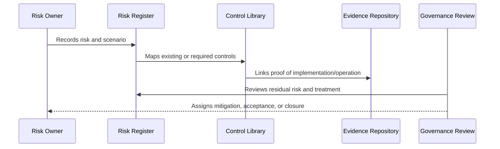

# Control Ownership and Maturity Model

> *"Defines control ownership requirements and a practical maturity model for CLARA controls."*

---

# Purpose

Defines control ownership requirements and a practical maturity model for CLARA controls.

---

# Governance Problem

A control may exist but still be immature if it is manual, inconsistent, untested, or not evidenced.

---

# Governance Decision

## Decision

CLARA should assess control maturity from ad-hoc to optimized so governance can improve over time.

## Status

Accepted.

---

# Risk and Control Rule

Every material CLARA risk must be governed as:

```text
Risk -> Owner -> Category -> Likelihood -> Impact -> Controls -> Residual Risk -> Treatment -> Evidence -> Review
```

Every important control must be governed as:

```text
Control -> Owner -> Requirement -> Implementation -> Evidence -> Maturity -> Review Cadence
```

---

# Recommended Governance Flow



---

# Secure-by-Design Checklist

- [ ] Risk owner is defined.
- [ ] Risk category is assigned.
- [ ] Likelihood and impact are assessed.
- [ ] Affected assets/data are identified.
- [ ] Controls are mapped.
- [ ] Residual risk is assessed.
- [ ] Treatment decision is recorded.
- [ ] Acceptance approval exists where needed.
- [ ] Evidence is linked.
- [ ] Review cadence is defined.

---

# Acceptance Criteria

- [ ] Risk structure is clear.
- [ ] Control structure is clear.
- [ ] Mapping process is clear.
- [ ] Evidence expectations are clear.
- [ ] Review cadence is clear.
- [ ] Dashboard/reporting expectations are clear.
- [ ] AI coding assistants can follow this safely.

---

# Anti-patterns

Avoid:

- Risk records with no owner.
- Risks tracked only in chat.
- Controls with no evidence.
- Accepting risk without approver.
- Closing risks without validation.
- Treating all risks as equal.
- Ignoring residual risk.
- Stale risk register.
- Control library disconnected from implementation.
- Reporting only green status while gaps are hidden.

---

# Related Documents

- ../PART-01-Security-Governance-Foundation/05-Risk-Management-Framework.md
- ../PART-07-Audit-Evidence-and-Compliance-Readiness/75-Control-to-Evidence-Mapping.md
- ../PART-09-Secure-SDLC-Governance/106-Secure-SDLC-Metrics-and-Evidence.md
- ../../BOOK-05-Engineering-Execution-Plan/PART-08-Security-Implementation-Plan/README.md

---

# Navigation

**Previous:** `113-Risk-to-Control-Mapping.md`

**Next:** `115-Residual-Risk-and-Risk-Treatment.md`

---

# Control Ownership

Every control needs:

```text
primary owner
backup owner where high-risk
implementation owner
evidence owner
review owner
```

---

# Maturity Levels

| Level | Meaning |
|---|---|
| 0 Ad-hoc | Informal, inconsistent, no evidence |
| 1 Defined | Documented expectation exists |
| 2 Implemented | Control exists in process/code |
| 3 Managed | Evidence and review cadence exist |
| 4 Measured | Metrics show operation/effectiveness |
| 5 Optimized | Continuously improved from evidence/incidents |

---

# Maturity Rule

MVP controls can start at Level 2 or 3.

High-risk controls should move toward Level 3+ before serious production use.
