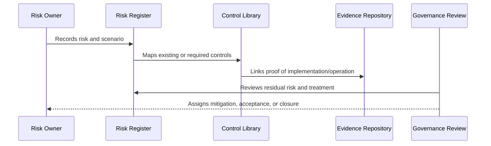

# Risk Acceptance Records

> *"Defines governance for risk acceptance, approval authority, expiration, compensating controls, and re-review."*

---

# Purpose

Defines governance for risk acceptance, approval authority, expiration, compensating controls, and re-review.

---

# Governance Problem

Silent risk acceptance creates hidden liabilities.

---

# Governance Decision

## Decision

CLARA risk acceptance must be explicit, owner-approved, time-bound where possible, and supported by compensating controls.

## Status

Accepted.

---

# Risk and Control Rule

Every material CLARA risk must be governed as:

```text
Risk -> Owner -> Category -> Likelihood -> Impact -> Controls -> Residual Risk -> Treatment -> Evidence -> Review
```

Every important control must be governed as:

```text
Control -> Owner -> Requirement -> Implementation -> Evidence -> Maturity -> Review Cadence
```

---

# Recommended Governance Flow



---

# Secure-by-Design Checklist

- [ ] Risk owner is defined.
- [ ] Risk category is assigned.
- [ ] Likelihood and impact are assessed.
- [ ] Affected assets/data are identified.
- [ ] Controls are mapped.
- [ ] Residual risk is assessed.
- [ ] Treatment decision is recorded.
- [ ] Acceptance approval exists where needed.
- [ ] Evidence is linked.
- [ ] Review cadence is defined.

---

# Acceptance Criteria

- [ ] Risk structure is clear.
- [ ] Control structure is clear.
- [ ] Mapping process is clear.
- [ ] Evidence expectations are clear.
- [ ] Review cadence is clear.
- [ ] Dashboard/reporting expectations are clear.
- [ ] AI coding assistants can follow this safely.

---

# Anti-patterns

Avoid:

- Risk records with no owner.
- Risks tracked only in chat.
- Controls with no evidence.
- Accepting risk without approver.
- Closing risks without validation.
- Treating all risks as equal.
- Ignoring residual risk.
- Stale risk register.
- Control library disconnected from implementation.
- Reporting only green status while gaps are hidden.

---

# Related Documents

- ../PART-01-Security-Governance-Foundation/05-Risk-Management-Framework.md
- ../PART-07-Audit-Evidence-and-Compliance-Readiness/75-Control-to-Evidence-Mapping.md
- ../PART-09-Secure-SDLC-Governance/106-Secure-SDLC-Metrics-and-Evidence.md
- ../../BOOK-05-Engineering-Execution-Plan/PART-08-Security-Implementation-Plan/README.md

---

# Navigation

**Previous:** `115-Residual-Risk-and-Risk-Treatment.md`

**Next:** `117-Control-Evidence-Mapping.md`

---

# Risk Acceptance Template

```markdown
# Risk Acceptance

## Risk ID
RISK-0001

## Risk Summary
Short description.

## Residual Risk
What remains after controls.

## Reason for Acceptance
Why not fully mitigating now.

## Compensating Controls
Temporary/reducing controls.

## Accepted By
Accountable approver.

## Owner
Risk owner.

## Expiration / Review Date
When this decision is revisited.

## Evidence
Links to analysis, tests, controls, or reviews.
```

---

# Risk Acceptance Rules

```text
no owner = not accepted
no approver = not accepted
no review date = weak acceptance
no compensating control for high risk = escalate
```
