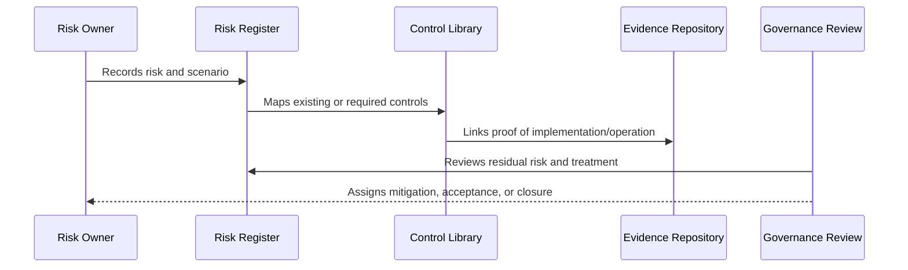

# Control Evidence Mapping

> *"Defines how controls are mapped to evidence from tests, logs, PRs, reviews, scans, runbooks, incidents, and audit records."*

---

# Purpose

Defines how controls are mapped to evidence from tests, logs, PRs, reviews, scans, runbooks, incidents, and audit records.

---

# Governance Problem

Controls without evidence cannot support compliance readiness or incident investigation.

---

# Governance Decision

## Decision

CLARA should know exactly which evidence proves each important control exists and operates.

## Status

Accepted.

---

# Risk and Control Rule

Every material CLARA risk must be governed as:

```text
Risk -> Owner -> Category -> Likelihood -> Impact -> Controls -> Residual Risk -> Treatment -> Evidence -> Review
```

Every important control must be governed as:

```text
Control -> Owner -> Requirement -> Implementation -> Evidence -> Maturity -> Review Cadence
```

---

# Recommended Governance Flow



---

# Secure-by-Design Checklist

- [ ] Risk owner is defined.
- [ ] Risk category is assigned.
- [ ] Likelihood and impact are assessed.
- [ ] Affected assets/data are identified.
- [ ] Controls are mapped.
- [ ] Residual risk is assessed.
- [ ] Treatment decision is recorded.
- [ ] Acceptance approval exists where needed.
- [ ] Evidence is linked.
- [ ] Review cadence is defined.

---

# Acceptance Criteria

- [ ] Risk structure is clear.
- [ ] Control structure is clear.
- [ ] Mapping process is clear.
- [ ] Evidence expectations are clear.
- [ ] Review cadence is clear.
- [ ] Dashboard/reporting expectations are clear.
- [ ] AI coding assistants can follow this safely.

---

# Anti-patterns

Avoid:

- Risk records with no owner.
- Risks tracked only in chat.
- Controls with no evidence.
- Accepting risk without approver.
- Closing risks without validation.
- Treating all risks as equal.
- Ignoring residual risk.
- Stale risk register.
- Control library disconnected from implementation.
- Reporting only green status while gaps are hidden.

---

# Related Documents

- ../PART-01-Security-Governance-Foundation/05-Risk-Management-Framework.md
- ../PART-07-Audit-Evidence-and-Compliance-Readiness/75-Control-to-Evidence-Mapping.md
- ../PART-09-Secure-SDLC-Governance/106-Secure-SDLC-Metrics-and-Evidence.md
- ../../BOOK-05-Engineering-Execution-Plan/PART-08-Security-Implementation-Plan/README.md

---

# Navigation

**Previous:** `116-Risk-Acceptance-Records.md`

**Next:** `118-Governance-Dashboard-and-Reporting.md`

---

# Evidence Mapping

Control evidence can include:

```text
automated tests
CI results
security scans
PR reviews
audit log samples
access review records
AI evaluation results
integration test results
incident postmortems
backup restore test results
release checklists
runbooks
```

---

# Evidence Quality

Evidence should be:

```text
linked
timestamped
owner-attributed
repeatable where possible
privacy-aware
reviewed on cadence
```

---

# Evidence Mapping Rule

A control is not audit-ready until its evidence source is known and accessible to authorized reviewers.
