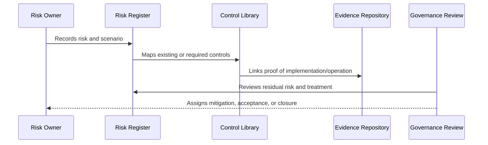

# Risk Review Cadence and Operating Rhythm

> *"Defines recurring risk reviews, control reviews, exception reviews, and reporting cadence."*

---

# Purpose

Defines recurring risk reviews, control reviews, exception reviews, and reporting cadence.

---

# Governance Problem

Risk registers decay quickly if not reviewed.

---

# Governance Decision

## Decision

CLARA should review risks and controls on a lightweight recurring cadence with clear follow-up actions.

## Status

Accepted.

---

# Risk and Control Rule

Every material CLARA risk must be governed as:

```text
Risk -> Owner -> Category -> Likelihood -> Impact -> Controls -> Residual Risk -> Treatment -> Evidence -> Review
```

Every important control must be governed as:

```text
Control -> Owner -> Requirement -> Implementation -> Evidence -> Maturity -> Review Cadence
```

---

# Recommended Governance Flow



---

# Secure-by-Design Checklist

- [ ] Risk owner is defined.
- [ ] Risk category is assigned.
- [ ] Likelihood and impact are assessed.
- [ ] Affected assets/data are identified.
- [ ] Controls are mapped.
- [ ] Residual risk is assessed.
- [ ] Treatment decision is recorded.
- [ ] Acceptance approval exists where needed.
- [ ] Evidence is linked.
- [ ] Review cadence is defined.

---

# Acceptance Criteria

- [ ] Risk structure is clear.
- [ ] Control structure is clear.
- [ ] Mapping process is clear.
- [ ] Evidence expectations are clear.
- [ ] Review cadence is clear.
- [ ] Dashboard/reporting expectations are clear.
- [ ] AI coding assistants can follow this safely.

---

# Anti-patterns

Avoid:

- Risk records with no owner.
- Risks tracked only in chat.
- Controls with no evidence.
- Accepting risk without approver.
- Closing risks without validation.
- Treating all risks as equal.
- Ignoring residual risk.
- Stale risk register.
- Control library disconnected from implementation.
- Reporting only green status while gaps are hidden.

---

# Related Documents

- ../PART-01-Security-Governance-Foundation/05-Risk-Management-Framework.md
- ../PART-07-Audit-Evidence-and-Compliance-Readiness/75-Control-to-Evidence-Mapping.md
- ../PART-09-Secure-SDLC-Governance/106-Secure-SDLC-Metrics-and-Evidence.md
- ../../BOOK-05-Engineering-Execution-Plan/PART-08-Security-Implementation-Plan/README.md

---

# Navigation

**Previous:** `118-Governance-Dashboard-and-Reporting.md`

**Next:** `120-Part-10-Summary.md`

---

# Review Cadence

Recommended:

| Review | Frequency |
|---|---|
| Critical/High risk review | Monthly or per release |
| Medium/Low risk review | Quarterly |
| Control evidence review | Quarterly |
| Accepted risk review | Before expiration and quarterly |
| Vendor/third-party risk review | Quarterly |
| AI risk review | Per major change and quarterly |
| Post-incident risk review | After incident |

---

# Review Output

Each review should produce:

```text
risks closed
risks updated
controls improved
accepted risks renewed/closed
new gaps
owners
due dates
evidence updates
```

---

# Operating Rhythm Rule

If no one reviews the register, the register becomes stale documentation.
