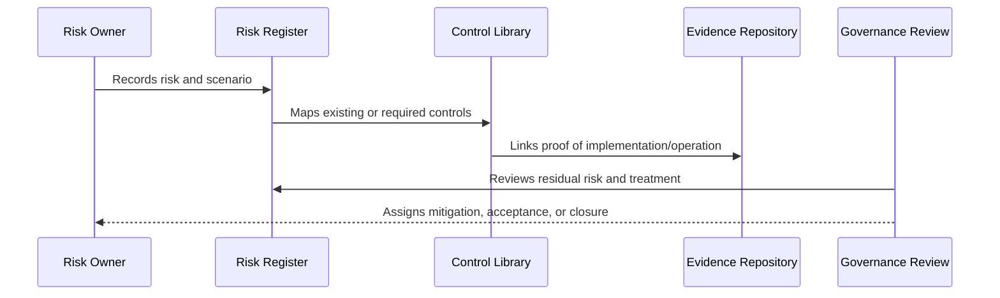

# Part 10 Summary

> *"Summarizes Risk Register and Control Mapping and prepares for Book VI Part 11."*

---

# Purpose

Summarizes Risk Register and Control Mapping and prepares for Book VI Part 11.

---

# Governance Problem

Compliance roadmap depends on knowing what risks and controls exist today.

---

# Governance Decision

## Decision

CLARA should proceed to Compliance Roadmap after defining risk register, taxonomy, control library, mappings, maturity, residual risk, acceptance, evidence, dashboard, and review cadence.

## Status

Accepted.

---

# Risk and Control Rule

Every material CLARA risk must be governed as:

```text
Risk -> Owner -> Category -> Likelihood -> Impact -> Controls -> Residual Risk -> Treatment -> Evidence -> Review
```

Every important control must be governed as:

```text
Control -> Owner -> Requirement -> Implementation -> Evidence -> Maturity -> Review Cadence
```

---

# Recommended Governance Flow



---

# Secure-by-Design Checklist

- [ ] Risk owner is defined.
- [ ] Risk category is assigned.
- [ ] Likelihood and impact are assessed.
- [ ] Affected assets/data are identified.
- [ ] Controls are mapped.
- [ ] Residual risk is assessed.
- [ ] Treatment decision is recorded.
- [ ] Acceptance approval exists where needed.
- [ ] Evidence is linked.
- [ ] Review cadence is defined.

---

# Acceptance Criteria

- [ ] Risk structure is clear.
- [ ] Control structure is clear.
- [ ] Mapping process is clear.
- [ ] Evidence expectations are clear.
- [ ] Review cadence is clear.
- [ ] Dashboard/reporting expectations are clear.
- [ ] AI coding assistants can follow this safely.

---

# Anti-patterns

Avoid:

- Risk records with no owner.
- Risks tracked only in chat.
- Controls with no evidence.
- Accepting risk without approver.
- Closing risks without validation.
- Treating all risks as equal.
- Ignoring residual risk.
- Stale risk register.
- Control library disconnected from implementation.
- Reporting only green status while gaps are hidden.

---

# Related Documents

- ../PART-01-Security-Governance-Foundation/05-Risk-Management-Framework.md
- ../PART-07-Audit-Evidence-and-Compliance-Readiness/75-Control-to-Evidence-Mapping.md
- ../PART-09-Secure-SDLC-Governance/106-Secure-SDLC-Metrics-and-Evidence.md
- ../../BOOK-05-Engineering-Execution-Plan/PART-08-Security-Implementation-Plan/README.md

---

# Navigation

**Previous:** `119-Risk-Review-Cadence-and-Operating-Rhythm.md`

**Next:** `../PART-11-Compliance-Roadmap/README.md`

---

# Part 10 Completion

Part 10 establishes:

- Risk register and control mapping overview.
- Risk register structure.
- Risk taxonomy and categories.
- Control library structure.
- Risk to control mapping.
- Control ownership and maturity model.
- Residual risk and risk treatment.
- Risk acceptance records.
- Control evidence mapping.
- Governance dashboard and reporting.
- Risk review cadence and operating rhythm.

---

# Ready for Part 11

The next part should be:

```text
BOOK VI — PART 11: Compliance Roadmap
```

It should define:

- Compliance readiness strategy.
- Framework alignment.
- Privacy compliance roadmap.
- Security certification roadmap.
- Customer trust roadmap.
- Evidence maturity roadmap.
- Control gap remediation roadmap.
- Audit preparation roadmap.
- External review readiness.
- Compliance operating milestones.
