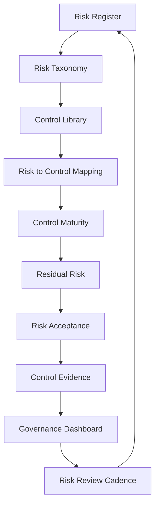

# PART-10 — Risk Register and Control Mapping

> *"A risk is not managed because it is known. A risk is managed when it has an owner, a decision, a control, and evidence."*

---

# Purpose

Part 10 defines CLARA's risk register and control mapping model.

It covers:

- Risk Register and Control Mapping overview.
- Risk Register Structure.
- Risk Taxonomy and Categories.
- Control Library Structure.
- Risk to Control Mapping.
- Control Ownership and Maturity Model.
- Residual Risk and Risk Treatment.
- Risk Acceptance Records.
- Control Evidence Mapping.
- Governance Dashboard and Reporting.
- Risk Review Cadence and Operating Rhythm.

---

# Chapter Map

| Chapter | Title |
|---:|---|
| 109 | Risk Register and Control Mapping Overview |
| 110 | Risk Register Structure |
| 111 | Risk Taxonomy and Categories |
| 112 | Control Library Structure |
| 113 | Risk to Control Mapping |
| 114 | Control Ownership and Maturity Model |
| 115 | Residual Risk and Risk Treatment |
| 116 | Risk Acceptance Records |
| 117 | Control Evidence Mapping |
| 118 | Governance Dashboard and Reporting |
| 119 | Risk Review Cadence and Operating Rhythm |
| 120 | Part 10 Summary |

---

# Risk and Control Map



---

# Governance Non-Negotiables

CLARA risk and control mapping must enforce:

```text
risk owner
risk category
risk scenario
affected asset
likelihood and impact
mapped controls
residual risk
treatment decision
acceptance approval where needed
control owner
control evidence
review cadence
dashboard visibility
```

---

# Relationship to Previous Parts

| Part | Contribution |
|---|---|
| Part 01 | Risk management foundation |
| Part 02 | Policies that require controls |
| Part 03 | Identity/access risks and controls |
| Part 04 | Data/privacy risks and controls |
| Part 05 | AI risks and controls |
| Part 06 | Third-party risks and controls |
| Part 07 | Evidence model |
| Part 08 | Incident learnings |
| Part 09 | Secure SDLC controls |
| Part 10 | Unified risk register and control map |

---

# Navigation

**Previous:** `../PART-09-Secure-SDLC-Governance/108-Part-09-Summary.md`

**Next:** `109-Risk-Register-and-Control-Mapping-Overview.md`
