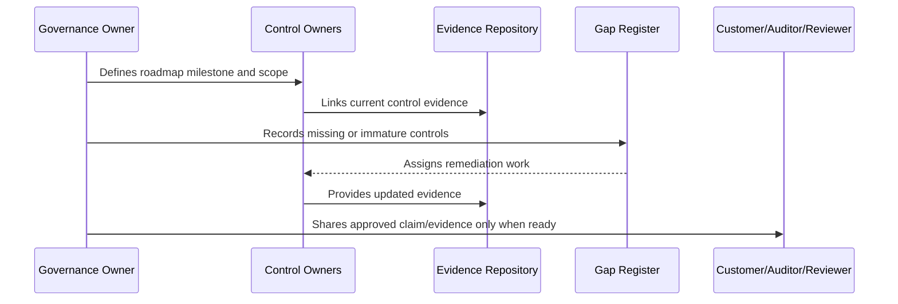

# Compliance Roadmap Overview

> *"Introduces CLARA's compliance roadmap from internal readiness to customer trust, evidence maturity, framework alignment, external review, and future certification planning."*

---

# Purpose

Introduces CLARA's compliance roadmap from internal readiness to customer trust, evidence maturity, framework alignment, external review, and future certification planning.

---

# Governance Problem

Compliance becomes risky when teams claim maturity before controls, evidence, ownership, and review cadence are actually operating.

---

# Governance Decision

## Decision

CLARA should approach compliance as a staged maturity roadmap based on real controls, evidence, risk management, and customer trust needs.

## Status

Accepted.

---

# Compliance Roadmap Rule

Every compliance milestone must be governed as:

```text
Scope -> Control Requirements -> Owner -> Evidence -> Gap Assessment -> Remediation -> Review -> External Claim Boundary
```

Do not make external claims that CLARA cannot prove internally.

Do not treat compliance as separate from engineering, security, privacy, AI, integrations, operations, and support.

---

# Recommended Compliance Flow



---

# Secure-by-Design Checklist

- [ ] Compliance scope is defined.
- [ ] Control owners are assigned.
- [ ] Evidence sources are identified.
- [ ] Gaps are tracked.
- [ ] Customer-facing claims are reviewed.
- [ ] Privacy impact is considered.
- [ ] AI impact is considered.
- [ ] Third-party/provider impact is considered.
- [ ] Audit readiness is not overclaimed.
- [ ] External review boundary is clear.

---

# Acceptance Criteria

- [ ] Roadmap stage is clear.
- [ ] Owners are clear.
- [ ] Evidence expectations are clear.
- [ ] Gap remediation expectations are clear.
- [ ] Customer/external readiness boundary is clear.
- [ ] No premature certification claim is made.
- [ ] AI coding assistants can follow this safely.

---

# Anti-patterns

Avoid:

- Saying CLARA is certified when it is only aligned.
- Pursuing audit before controls operate.
- Writing policies with no evidence.
- Sharing raw sensitive evidence with customers.
- Treating privacy as a legal-only task.
- Treating AI governance as optional.
- Closing compliance gaps without proof.
- Building trust center claims that engineering cannot prove.
- Ignoring third-party providers in compliance scope.
- Making roadmap milestones with no owner.

---

# Related Documents

- ../PART-07-Audit-Evidence-and-Compliance-Readiness/README.md
- ../PART-10-Risk-Register-and-Control-Mapping/README.md
- ../PART-04-Data-Protection-and-Privacy-Governance/README.md
- ../PART-05-AI-Governance-and-Model-Risk/README.md
- ../PART-06-Integration-and-Third-Party-Governance/README.md

---

# Navigation

**Previous:** `../PART-10-Risk-Register-and-Control-Mapping/120-Part-10-Summary.md`

**Next:** `122-Compliance-Readiness-Strategy.md`

---

# Compliance Roadmap Scope

CLARA roadmap covers:

```text
internal governance readiness
customer security questionnaire readiness
privacy compliance maturity
security control maturity
AI governance maturity
third-party risk maturity
audit evidence maturity
external review readiness
future certification planning
```

---

# Core Questions

CLARA should answer:

```text
What compliance maturity do we need now?
What will customers ask for?
What evidence do we already have?
What controls are missing?
What can we safely claim?
What should wait until formal review?
```
