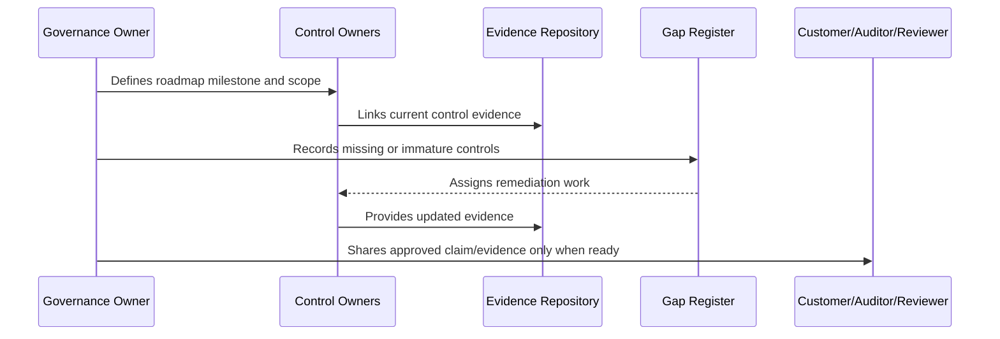

# Framework Alignment Strategy

> *"Defines how CLARA aligns controls with common security, privacy, and operational framework themes without claiming certification prematurely."*

---

# Purpose

Defines how CLARA aligns controls with common security, privacy, and operational framework themes without claiming certification prematurely.

---

# Governance Problem

Framework alignment is useful, but it must not be confused with formal compliance certification.

---

# Governance Decision

## Decision

CLARA should align controls to framework themes such as access control, data protection, incident response, vendor risk, secure development, and business continuity.

## Status

Accepted.

---

# Compliance Roadmap Rule

Every compliance milestone must be governed as:

```text
Scope -> Control Requirements -> Owner -> Evidence -> Gap Assessment -> Remediation -> Review -> External Claim Boundary
```

Do not make external claims that CLARA cannot prove internally.

Do not treat compliance as separate from engineering, security, privacy, AI, integrations, operations, and support.

---

# Recommended Compliance Flow



---

# Secure-by-Design Checklist

- [ ] Compliance scope is defined.
- [ ] Control owners are assigned.
- [ ] Evidence sources are identified.
- [ ] Gaps are tracked.
- [ ] Customer-facing claims are reviewed.
- [ ] Privacy impact is considered.
- [ ] AI impact is considered.
- [ ] Third-party/provider impact is considered.
- [ ] Audit readiness is not overclaimed.
- [ ] External review boundary is clear.

---

# Acceptance Criteria

- [ ] Roadmap stage is clear.
- [ ] Owners are clear.
- [ ] Evidence expectations are clear.
- [ ] Gap remediation expectations are clear.
- [ ] Customer/external readiness boundary is clear.
- [ ] No premature certification claim is made.
- [ ] AI coding assistants can follow this safely.

---

# Anti-patterns

Avoid:

- Saying CLARA is certified when it is only aligned.
- Pursuing audit before controls operate.
- Writing policies with no evidence.
- Sharing raw sensitive evidence with customers.
- Treating privacy as a legal-only task.
- Treating AI governance as optional.
- Closing compliance gaps without proof.
- Building trust center claims that engineering cannot prove.
- Ignoring third-party providers in compliance scope.
- Making roadmap milestones with no owner.

---

# Related Documents

- ../PART-07-Audit-Evidence-and-Compliance-Readiness/README.md
- ../PART-10-Risk-Register-and-Control-Mapping/README.md
- ../PART-04-Data-Protection-and-Privacy-Governance/README.md
- ../PART-05-AI-Governance-and-Model-Risk/README.md
- ../PART-06-Integration-and-Third-Party-Governance/README.md

---

# Navigation

**Previous:** `122-Compliance-Readiness-Strategy.md`

**Next:** `124-Privacy-Compliance-Roadmap.md`

---

# Framework Theme Alignment

CLARA can align controls around common themes:

```text
access control
asset and data inventory
secure development
change management
incident response
vendor risk
data protection
logging and monitoring
business continuity
risk management
policy governance
vulnerability management
AI governance
```

---

# Alignment vs Certification

Alignment means:

```text
our controls map to framework-like expectations
```

Certification means:

```text
a formal external process has verified scope and controls
```

Do not confuse the two.

---

# Framework Mapping Template

```markdown
## Framework Theme
Access Control

## CLARA Controls
- RBAC
- Workspace scope checks
- Access reviews

## Evidence
- Access tests
- Review records
- Audit logs

## Gaps
- Quarterly review automation not mature yet
```
