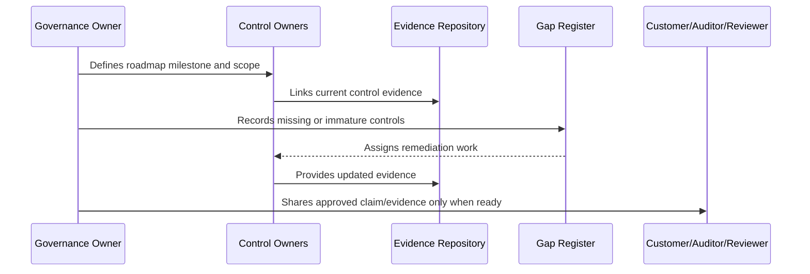

# Privacy Compliance Roadmap

> *"Defines the privacy compliance maturity roadmap for data inventory, lawful purpose, minimization, retention, deletion, exports, AI privacy, and privacy review."*

---

# Purpose

Defines the privacy compliance maturity roadmap for data inventory, lawful purpose, minimization, retention, deletion, exports, AI privacy, and privacy review.

---

# Governance Problem

Privacy compliance risk increases when products collect customer data without purpose, retention boundaries, deletion paths, or evidence.

---

# Governance Decision

## Decision

CLARA privacy maturity should grow from data classification and inventory into privacy review, retention/deletion discipline, customer data request readiness, and audit evidence.

## Status

Accepted.

---

# Compliance Roadmap Rule

Every compliance milestone must be governed as:

```text
Scope -> Control Requirements -> Owner -> Evidence -> Gap Assessment -> Remediation -> Review -> External Claim Boundary
```

Do not make external claims that CLARA cannot prove internally.

Do not treat compliance as separate from engineering, security, privacy, AI, integrations, operations, and support.

---

# Recommended Compliance Flow



---

# Secure-by-Design Checklist

- [ ] Compliance scope is defined.
- [ ] Control owners are assigned.
- [ ] Evidence sources are identified.
- [ ] Gaps are tracked.
- [ ] Customer-facing claims are reviewed.
- [ ] Privacy impact is considered.
- [ ] AI impact is considered.
- [ ] Third-party/provider impact is considered.
- [ ] Audit readiness is not overclaimed.
- [ ] External review boundary is clear.

---

# Acceptance Criteria

- [ ] Roadmap stage is clear.
- [ ] Owners are clear.
- [ ] Evidence expectations are clear.
- [ ] Gap remediation expectations are clear.
- [ ] Customer/external readiness boundary is clear.
- [ ] No premature certification claim is made.
- [ ] AI coding assistants can follow this safely.

---

# Anti-patterns

Avoid:

- Saying CLARA is certified when it is only aligned.
- Pursuing audit before controls operate.
- Writing policies with no evidence.
- Sharing raw sensitive evidence with customers.
- Treating privacy as a legal-only task.
- Treating AI governance as optional.
- Closing compliance gaps without proof.
- Building trust center claims that engineering cannot prove.
- Ignoring third-party providers in compliance scope.
- Making roadmap milestones with no owner.

---

# Related Documents

- ../PART-07-Audit-Evidence-and-Compliance-Readiness/README.md
- ../PART-10-Risk-Register-and-Control-Mapping/README.md
- ../PART-04-Data-Protection-and-Privacy-Governance/README.md
- ../PART-05-AI-Governance-and-Model-Risk/README.md
- ../PART-06-Integration-and-Third-Party-Governance/README.md

---

# Navigation

**Previous:** `123-Framework-Alignment-Strategy.md`

**Next:** `125-Security-Certification-Roadmap.md`

---

# Privacy Roadmap Stages

```text
1. Data classification
2. Data inventory
3. Data ownership
4. Retention/deletion baseline
5. Export governance
6. Privacy review process
7. Data subject/customer request readiness where applicable
8. AI privacy controls
9. Third-party data sharing inventory
10. Privacy evidence maturity
```

---

# Privacy Evidence

Useful evidence includes:

```text
data inventory
classification records
privacy review checklists
export audit logs
retention job logs
AI context tests
third-party data sharing records
deletion request records
```

---

# Privacy Rule

CLARA should avoid collecting, retaining, or sharing data without clear purpose and owner.
