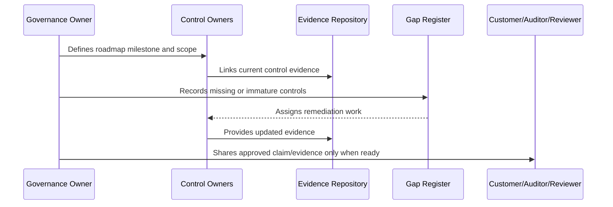

# Security Certification Roadmap

> *"Defines a staged roadmap toward future security certification or external audit readiness."*

---

# Purpose

Defines a staged roadmap toward future security certification or external audit readiness.

---

# Governance Problem

External audits are expensive and painful if basic control ownership, evidence, and gap remediation are immature.

---

# Governance Decision

## Decision

CLARA should build certification readiness by first operating controls and evidence internally before pursuing formal third-party assessment.

## Status

Accepted.

---

# Compliance Roadmap Rule

Every compliance milestone must be governed as:

```text
Scope -> Control Requirements -> Owner -> Evidence -> Gap Assessment -> Remediation -> Review -> External Claim Boundary
```

Do not make external claims that CLARA cannot prove internally.

Do not treat compliance as separate from engineering, security, privacy, AI, integrations, operations, and support.

---

# Recommended Compliance Flow



---

# Secure-by-Design Checklist

- [ ] Compliance scope is defined.
- [ ] Control owners are assigned.
- [ ] Evidence sources are identified.
- [ ] Gaps are tracked.
- [ ] Customer-facing claims are reviewed.
- [ ] Privacy impact is considered.
- [ ] AI impact is considered.
- [ ] Third-party/provider impact is considered.
- [ ] Audit readiness is not overclaimed.
- [ ] External review boundary is clear.

---

# Acceptance Criteria

- [ ] Roadmap stage is clear.
- [ ] Owners are clear.
- [ ] Evidence expectations are clear.
- [ ] Gap remediation expectations are clear.
- [ ] Customer/external readiness boundary is clear.
- [ ] No premature certification claim is made.
- [ ] AI coding assistants can follow this safely.

---

# Anti-patterns

Avoid:

- Saying CLARA is certified when it is only aligned.
- Pursuing audit before controls operate.
- Writing policies with no evidence.
- Sharing raw sensitive evidence with customers.
- Treating privacy as a legal-only task.
- Treating AI governance as optional.
- Closing compliance gaps without proof.
- Building trust center claims that engineering cannot prove.
- Ignoring third-party providers in compliance scope.
- Making roadmap milestones with no owner.

---

# Related Documents

- ../PART-07-Audit-Evidence-and-Compliance-Readiness/README.md
- ../PART-10-Risk-Register-and-Control-Mapping/README.md
- ../PART-04-Data-Protection-and-Privacy-Governance/README.md
- ../PART-05-AI-Governance-and-Model-Risk/README.md
- ../PART-06-Integration-and-Third-Party-Governance/README.md

---

# Navigation

**Previous:** `124-Privacy-Compliance-Roadmap.md`

**Next:** `126-Customer-Trust-Roadmap.md`

---

# Certification Readiness Stages

```text
1. Control library created
2. Control owners assigned
3. Control evidence mapped
4. Control gaps remediated
5. Internal review cadence operating
6. Mock audit or advisory review
7. External audit readiness decision
8. Formal assessment if needed
```

---

# Certification Planning Questions

Ask:

```text
What business/customer need justifies certification?
What scope is included?
What systems/data are in scope?
What controls are mature enough?
What gaps must be closed first?
Who owns audit coordination?
```

---

# Warning

Do not treat certification as a shortcut to security.

Certification can validate controls, but it does not replace secure engineering.
