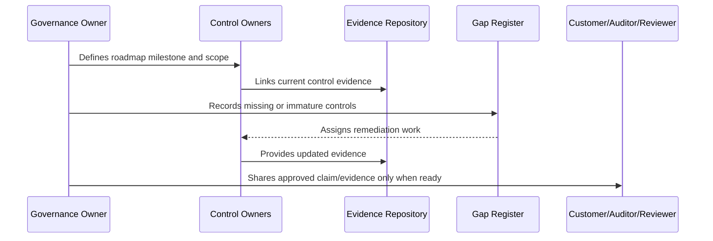

# Customer Trust Roadmap

> *"Defines how CLARA should prepare customer-facing trust materials, questionnaire responses, security summaries, and safe evidence-sharing boundaries."*

---

# Purpose

Defines how CLARA should prepare customer-facing trust materials, questionnaire responses, security summaries, and safe evidence-sharing boundaries.

---

# Governance Problem

Customer trust is damaged when teams overpromise security controls or share sensitive internal details carelessly.

---

# Governance Decision

## Decision

CLARA customer trust should be built through accurate communication, evidence-backed answers, responsible disclosure boundaries, and visible security maturity.

## Status

Accepted.

---

# Compliance Roadmap Rule

Every compliance milestone must be governed as:

```text
Scope -> Control Requirements -> Owner -> Evidence -> Gap Assessment -> Remediation -> Review -> External Claim Boundary
```

Do not make external claims that CLARA cannot prove internally.

Do not treat compliance as separate from engineering, security, privacy, AI, integrations, operations, and support.

---

# Recommended Compliance Flow



---

# Secure-by-Design Checklist

- [ ] Compliance scope is defined.
- [ ] Control owners are assigned.
- [ ] Evidence sources are identified.
- [ ] Gaps are tracked.
- [ ] Customer-facing claims are reviewed.
- [ ] Privacy impact is considered.
- [ ] AI impact is considered.
- [ ] Third-party/provider impact is considered.
- [ ] Audit readiness is not overclaimed.
- [ ] External review boundary is clear.

---

# Acceptance Criteria

- [ ] Roadmap stage is clear.
- [ ] Owners are clear.
- [ ] Evidence expectations are clear.
- [ ] Gap remediation expectations are clear.
- [ ] Customer/external readiness boundary is clear.
- [ ] No premature certification claim is made.
- [ ] AI coding assistants can follow this safely.

---

# Anti-patterns

Avoid:

- Saying CLARA is certified when it is only aligned.
- Pursuing audit before controls operate.
- Writing policies with no evidence.
- Sharing raw sensitive evidence with customers.
- Treating privacy as a legal-only task.
- Treating AI governance as optional.
- Closing compliance gaps without proof.
- Building trust center claims that engineering cannot prove.
- Ignoring third-party providers in compliance scope.
- Making roadmap milestones with no owner.

---

# Related Documents

- ../PART-07-Audit-Evidence-and-Compliance-Readiness/README.md
- ../PART-10-Risk-Register-and-Control-Mapping/README.md
- ../PART-04-Data-Protection-and-Privacy-Governance/README.md
- ../PART-05-AI-Governance-and-Model-Risk/README.md
- ../PART-06-Integration-and-Third-Party-Governance/README.md

---

# Navigation

**Previous:** `125-Security-Certification-Roadmap.md`

**Next:** `127-Evidence-Maturity-Roadmap.md`

---

# Customer Trust Assets

Prepare:

```text
security overview
privacy overview
AI governance summary
integration security summary
incident response summary
subprocessor/provider list
responsible disclosure process
security contact path
common security questionnaire answers
```

---

# Trust Material Rules

Customer-facing materials must be:

```text
accurate
reviewed
evidence-backed
scope-aware
safe to share
not over-detailed
not overclaimed
```

---

# Trust Boundary

Do not share:

```text
raw logs
secrets
private architecture details
vulnerability details before remediation
customer-specific evidence
internal incident notes unless approved
```
