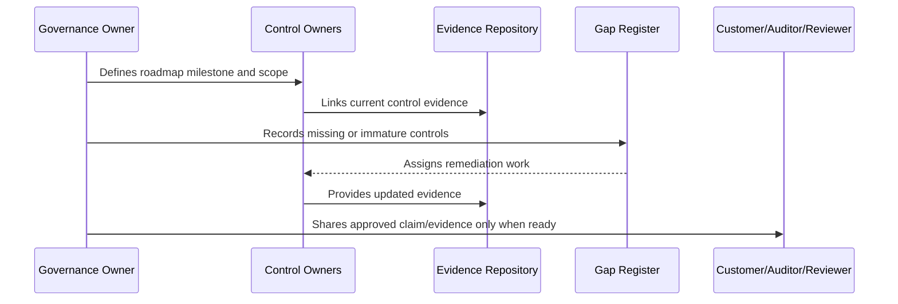

# Evidence Maturity Roadmap

> *"Defines how CLARA matures from ad-hoc evidence into repeatable, reviewable, control-linked evidence management."*

---

# Purpose

Defines how CLARA matures from ad-hoc evidence into repeatable, reviewable, control-linked evidence management.

---

# Governance Problem

Compliance readiness cannot scale if evidence is scattered, outdated, or dependent on individual memory.

---

# Governance Decision

## Decision

CLARA evidence maturity should progress from manual checklists to structured control evidence, automated evidence where practical, review cadence, and audit-ready repositories.

## Status

Accepted.

---

# Compliance Roadmap Rule

Every compliance milestone must be governed as:

```text
Scope -> Control Requirements -> Owner -> Evidence -> Gap Assessment -> Remediation -> Review -> External Claim Boundary
```

Do not make external claims that CLARA cannot prove internally.

Do not treat compliance as separate from engineering, security, privacy, AI, integrations, operations, and support.

---

# Recommended Compliance Flow



---

# Secure-by-Design Checklist

- [ ] Compliance scope is defined.
- [ ] Control owners are assigned.
- [ ] Evidence sources are identified.
- [ ] Gaps are tracked.
- [ ] Customer-facing claims are reviewed.
- [ ] Privacy impact is considered.
- [ ] AI impact is considered.
- [ ] Third-party/provider impact is considered.
- [ ] Audit readiness is not overclaimed.
- [ ] External review boundary is clear.

---

# Acceptance Criteria

- [ ] Roadmap stage is clear.
- [ ] Owners are clear.
- [ ] Evidence expectations are clear.
- [ ] Gap remediation expectations are clear.
- [ ] Customer/external readiness boundary is clear.
- [ ] No premature certification claim is made.
- [ ] AI coding assistants can follow this safely.

---

# Anti-patterns

Avoid:

- Saying CLARA is certified when it is only aligned.
- Pursuing audit before controls operate.
- Writing policies with no evidence.
- Sharing raw sensitive evidence with customers.
- Treating privacy as a legal-only task.
- Treating AI governance as optional.
- Closing compliance gaps without proof.
- Building trust center claims that engineering cannot prove.
- Ignoring third-party providers in compliance scope.
- Making roadmap milestones with no owner.

---

# Related Documents

- ../PART-07-Audit-Evidence-and-Compliance-Readiness/README.md
- ../PART-10-Risk-Register-and-Control-Mapping/README.md
- ../PART-04-Data-Protection-and-Privacy-Governance/README.md
- ../PART-05-AI-Governance-and-Model-Risk/README.md
- ../PART-06-Integration-and-Third-Party-Governance/README.md

---

# Navigation

**Previous:** `126-Customer-Trust-Roadmap.md`

**Next:** `128-Control-Gap-Remediation-Roadmap.md`

---

# Evidence Maturity Levels

| Level | Meaning |
|---|---|
| 0 Ad-hoc | Evidence scattered or missing |
| 1 Manual | Evidence collected manually |
| 2 Structured | Evidence organized by control |
| 3 Reviewed | Evidence reviewed on cadence |
| 4 Partially Automated | Some evidence produced by CI/logs/tools |
| 5 Audit-Ready | Evidence complete, scoped, reviewed, and retained |

---

# Evidence Roadmap

```text
create evidence repository
map controls to evidence
define evidence owners
standardize naming
review evidence quarterly
automate evidence where practical
prepare customer-safe evidence packages
```

---

# Evidence Rule

Evidence must prove both:

```text
control exists
control operates
```
