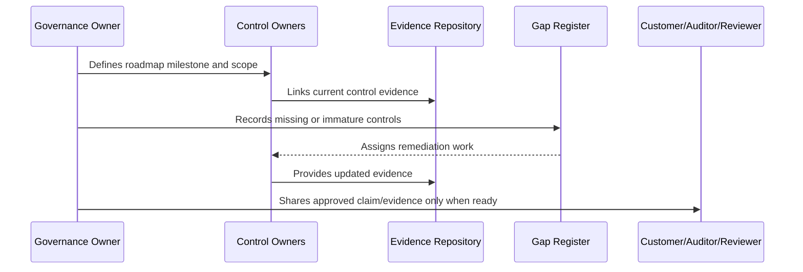

# Audit Preparation Roadmap

> *"Defines CLARA's staged audit preparation roadmap including scope, evidence, owners, gap review, mock audit, and formal audit readiness."*

---

# Purpose

Defines CLARA's staged audit preparation roadmap including scope, evidence, owners, gap review, mock audit, and formal audit readiness.

---

# Governance Problem

Audit preparation fails when evidence is collected after the fact or scope is unclear.

---

# Governance Decision

## Decision

CLARA audit preparation should start with scope clarity and evidence readiness before inviting external review.

## Status

Accepted.

---

# Compliance Roadmap Rule

Every compliance milestone must be governed as:

```text
Scope -> Control Requirements -> Owner -> Evidence -> Gap Assessment -> Remediation -> Review -> External Claim Boundary
```

Do not make external claims that CLARA cannot prove internally.

Do not treat compliance as separate from engineering, security, privacy, AI, integrations, operations, and support.

---

# Recommended Compliance Flow



---

# Secure-by-Design Checklist

- [ ] Compliance scope is defined.
- [ ] Control owners are assigned.
- [ ] Evidence sources are identified.
- [ ] Gaps are tracked.
- [ ] Customer-facing claims are reviewed.
- [ ] Privacy impact is considered.
- [ ] AI impact is considered.
- [ ] Third-party/provider impact is considered.
- [ ] Audit readiness is not overclaimed.
- [ ] External review boundary is clear.

---

# Acceptance Criteria

- [ ] Roadmap stage is clear.
- [ ] Owners are clear.
- [ ] Evidence expectations are clear.
- [ ] Gap remediation expectations are clear.
- [ ] Customer/external readiness boundary is clear.
- [ ] No premature certification claim is made.
- [ ] AI coding assistants can follow this safely.

---

# Anti-patterns

Avoid:

- Saying CLARA is certified when it is only aligned.
- Pursuing audit before controls operate.
- Writing policies with no evidence.
- Sharing raw sensitive evidence with customers.
- Treating privacy as a legal-only task.
- Treating AI governance as optional.
- Closing compliance gaps without proof.
- Building trust center claims that engineering cannot prove.
- Ignoring third-party providers in compliance scope.
- Making roadmap milestones with no owner.

---

# Related Documents

- ../PART-07-Audit-Evidence-and-Compliance-Readiness/README.md
- ../PART-10-Risk-Register-and-Control-Mapping/README.md
- ../PART-04-Data-Protection-and-Privacy-Governance/README.md
- ../PART-05-AI-Governance-and-Model-Risk/README.md
- ../PART-06-Integration-and-Third-Party-Governance/README.md

---

# Navigation

**Previous:** `128-Control-Gap-Remediation-Roadmap.md`

**Next:** `130-External-Review-Readiness.md`

---

# Audit Preparation Stages

```text
1. Define audit/review scope
2. Confirm control library
3. Confirm evidence mapping
4. Close critical/high gaps
5. Run internal readiness review
6. Run mock/advisory review
7. Prepare evidence package
8. Assign audit owner
9. Track findings
10. Remediate findings
```

---

# Audit Scope Questions

```text
Which products/modules?
Which environments?
Which data types?
Which providers?
Which AI features?
Which controls?
Which period?
```

---

# Audit Prep Rule

Audit preparation should not begin with evidence hunting.

It should begin with scope and control mapping.
