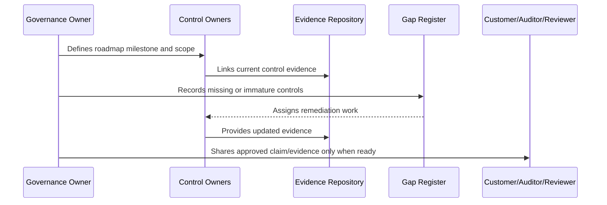

# External Review Readiness

> *"Defines readiness for customer security reviews, vendor due diligence, partner reviews, penetration testing, and external advisory assessments."*

---

# Purpose

Defines readiness for customer security reviews, vendor due diligence, partner reviews, penetration testing, and external advisory assessments.

---

# Governance Problem

External reviews can create inconsistent commitments or unsafe disclosures if handled informally.

---

# Governance Decision

## Decision

CLARA should handle external reviews through controlled scope, approved evidence, owner review, confidentiality boundaries, and follow-up tracking.

## Status

Accepted.

---

# Compliance Roadmap Rule

Every compliance milestone must be governed as:

```text
Scope -> Control Requirements -> Owner -> Evidence -> Gap Assessment -> Remediation -> Review -> External Claim Boundary
```

Do not make external claims that CLARA cannot prove internally.

Do not treat compliance as separate from engineering, security, privacy, AI, integrations, operations, and support.

---

# Recommended Compliance Flow



---

# Secure-by-Design Checklist

- [ ] Compliance scope is defined.
- [ ] Control owners are assigned.
- [ ] Evidence sources are identified.
- [ ] Gaps are tracked.
- [ ] Customer-facing claims are reviewed.
- [ ] Privacy impact is considered.
- [ ] AI impact is considered.
- [ ] Third-party/provider impact is considered.
- [ ] Audit readiness is not overclaimed.
- [ ] External review boundary is clear.

---

# Acceptance Criteria

- [ ] Roadmap stage is clear.
- [ ] Owners are clear.
- [ ] Evidence expectations are clear.
- [ ] Gap remediation expectations are clear.
- [ ] Customer/external readiness boundary is clear.
- [ ] No premature certification claim is made.
- [ ] AI coding assistants can follow this safely.

---

# Anti-patterns

Avoid:

- Saying CLARA is certified when it is only aligned.
- Pursuing audit before controls operate.
- Writing policies with no evidence.
- Sharing raw sensitive evidence with customers.
- Treating privacy as a legal-only task.
- Treating AI governance as optional.
- Closing compliance gaps without proof.
- Building trust center claims that engineering cannot prove.
- Ignoring third-party providers in compliance scope.
- Making roadmap milestones with no owner.

---

# Related Documents

- ../PART-07-Audit-Evidence-and-Compliance-Readiness/README.md
- ../PART-10-Risk-Register-and-Control-Mapping/README.md
- ../PART-04-Data-Protection-and-Privacy-Governance/README.md
- ../PART-05-AI-Governance-and-Model-Risk/README.md
- ../PART-06-Integration-and-Third-Party-Governance/README.md

---

# Navigation

**Previous:** `129-Audit-Preparation-Roadmap.md`

**Next:** `131-Compliance-Operating-Milestones.md`

---

# External Review Types

External reviews may include:

```text
customer security questionnaire
vendor due diligence
partner review
penetration test
privacy review
architecture review
formal audit readiness assessment
```

---

# External Review Rules

- Define scope.
- Use approved answers.
- Share only approved evidence.
- Track commitments.
- Assign owner.
- Escalate unknown/high-risk questions.
- Record what was shared.
- Convert findings into tracked gaps.

---

# Review Evidence Boundary

Use tiers:

```text
public
NDA-bound
restricted
internal only
```
