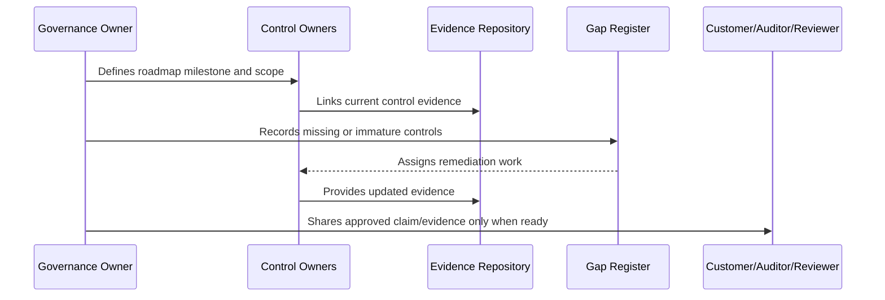

# Compliance Operating Milestones

> *"Defines practical compliance operating milestones from MVP governance to enterprise readiness."*

---

# Purpose

Defines practical compliance operating milestones from MVP governance to enterprise readiness.

---

# Governance Problem

Without operating milestones, compliance roadmap becomes abstract and hard to execute.

---

# Governance Decision

## Decision

CLARA compliance maturity should advance through measurable milestones with owners, control maturity targets, evidence expectations, and review cadence.

## Status

Accepted.

---

# Compliance Roadmap Rule

Every compliance milestone must be governed as:

```text
Scope -> Control Requirements -> Owner -> Evidence -> Gap Assessment -> Remediation -> Review -> External Claim Boundary
```

Do not make external claims that CLARA cannot prove internally.

Do not treat compliance as separate from engineering, security, privacy, AI, integrations, operations, and support.

---

# Recommended Compliance Flow



---

# Secure-by-Design Checklist

- [ ] Compliance scope is defined.
- [ ] Control owners are assigned.
- [ ] Evidence sources are identified.
- [ ] Gaps are tracked.
- [ ] Customer-facing claims are reviewed.
- [ ] Privacy impact is considered.
- [ ] AI impact is considered.
- [ ] Third-party/provider impact is considered.
- [ ] Audit readiness is not overclaimed.
- [ ] External review boundary is clear.

---

# Acceptance Criteria

- [ ] Roadmap stage is clear.
- [ ] Owners are clear.
- [ ] Evidence expectations are clear.
- [ ] Gap remediation expectations are clear.
- [ ] Customer/external readiness boundary is clear.
- [ ] No premature certification claim is made.
- [ ] AI coding assistants can follow this safely.

---

# Anti-patterns

Avoid:

- Saying CLARA is certified when it is only aligned.
- Pursuing audit before controls operate.
- Writing policies with no evidence.
- Sharing raw sensitive evidence with customers.
- Treating privacy as a legal-only task.
- Treating AI governance as optional.
- Closing compliance gaps without proof.
- Building trust center claims that engineering cannot prove.
- Ignoring third-party providers in compliance scope.
- Making roadmap milestones with no owner.

---

# Related Documents

- ../PART-07-Audit-Evidence-and-Compliance-Readiness/README.md
- ../PART-10-Risk-Register-and-Control-Mapping/README.md
- ../PART-04-Data-Protection-and-Privacy-Governance/README.md
- ../PART-05-AI-Governance-and-Model-Risk/README.md
- ../PART-06-Integration-and-Third-Party-Governance/README.md

---

# Navigation

**Previous:** `130-External-Review-Readiness.md`

**Next:** `132-Part-11-Summary.md`

---

# Operating Milestones

Recommended milestones:

| Milestone | Outcome |
|---|---|
| M1 | Risk register and control library exist |
| M2 | Evidence repository exists |
| M3 | High-risk controls mapped to evidence |
| M4 | Access/data/AI/integration reviews operating |
| M5 | Customer questionnaire pack ready |
| M6 | Trust material v1 ready |
| M7 | Critical/high gaps remediated or accepted |
| M8 | Mock audit/advisory review complete |
| M9 | External audit readiness decision |
| M10 | Formal assessment if business need justifies |

---

# Milestone Rule

Every milestone needs:

```text
owner
target date
evidence
decision
next step
```
