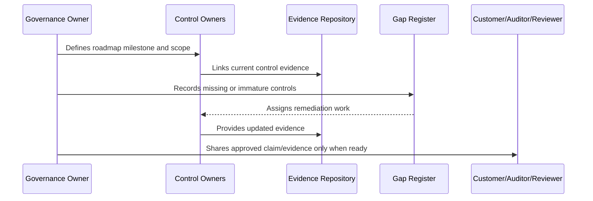

# Part 11 Summary

> *"Summarizes Compliance Roadmap and prepares for Book VI Part 12."*

---

# Purpose

Summarizes Compliance Roadmap and prepares for Book VI Part 12.

---

# Governance Problem

Governance handover comes next because compliance roadmap needs a durable operating manual and ownership model.

---

# Governance Decision

## Decision

CLARA should proceed to Governance Handover and Operating Manual after compliance strategy, framework alignment, privacy roadmap, certification roadmap, customer trust, evidence maturity, gap remediation, audit preparation, external review readiness, and operating milestones are defined.

## Status

Accepted.

---

# Compliance Roadmap Rule

Every compliance milestone must be governed as:

```text
Scope -> Control Requirements -> Owner -> Evidence -> Gap Assessment -> Remediation -> Review -> External Claim Boundary
```

Do not make external claims that CLARA cannot prove internally.

Do not treat compliance as separate from engineering, security, privacy, AI, integrations, operations, and support.

---

# Recommended Compliance Flow



---

# Secure-by-Design Checklist

- [ ] Compliance scope is defined.
- [ ] Control owners are assigned.
- [ ] Evidence sources are identified.
- [ ] Gaps are tracked.
- [ ] Customer-facing claims are reviewed.
- [ ] Privacy impact is considered.
- [ ] AI impact is considered.
- [ ] Third-party/provider impact is considered.
- [ ] Audit readiness is not overclaimed.
- [ ] External review boundary is clear.

---

# Acceptance Criteria

- [ ] Roadmap stage is clear.
- [ ] Owners are clear.
- [ ] Evidence expectations are clear.
- [ ] Gap remediation expectations are clear.
- [ ] Customer/external readiness boundary is clear.
- [ ] No premature certification claim is made.
- [ ] AI coding assistants can follow this safely.

---

# Anti-patterns

Avoid:

- Saying CLARA is certified when it is only aligned.
- Pursuing audit before controls operate.
- Writing policies with no evidence.
- Sharing raw sensitive evidence with customers.
- Treating privacy as a legal-only task.
- Treating AI governance as optional.
- Closing compliance gaps without proof.
- Building trust center claims that engineering cannot prove.
- Ignoring third-party providers in compliance scope.
- Making roadmap milestones with no owner.

---

# Related Documents

- ../PART-07-Audit-Evidence-and-Compliance-Readiness/README.md
- ../PART-10-Risk-Register-and-Control-Mapping/README.md
- ../PART-04-Data-Protection-and-Privacy-Governance/README.md
- ../PART-05-AI-Governance-and-Model-Risk/README.md
- ../PART-06-Integration-and-Third-Party-Governance/README.md

---

# Navigation

**Previous:** `131-Compliance-Operating-Milestones.md`

**Next:** `../PART-12-Governance-Handover-and-Operating-Manual/README.md`

---

# Part 11 Completion

Part 11 establishes:

- Compliance roadmap overview.
- Compliance readiness strategy.
- Framework alignment strategy.
- Privacy compliance roadmap.
- Security certification roadmap.
- Customer trust roadmap.
- Evidence maturity roadmap.
- Control gap remediation roadmap.
- Audit preparation roadmap.
- External review readiness.
- Compliance operating milestones.

---

# Ready for Part 12

The next part should be:

```text
BOOK VI — PART 12: Governance Handover and Operating Manual
```

It should define:

- Governance operating manual.
- Security ownership handover.
- Policy handover.
- Risk/control handover.
- Evidence handover.
- Compliance roadmap handover.
- Review cadence calendar.
- Governance runbooks.
- Book VI closure.
- Book VI master index preparation.
