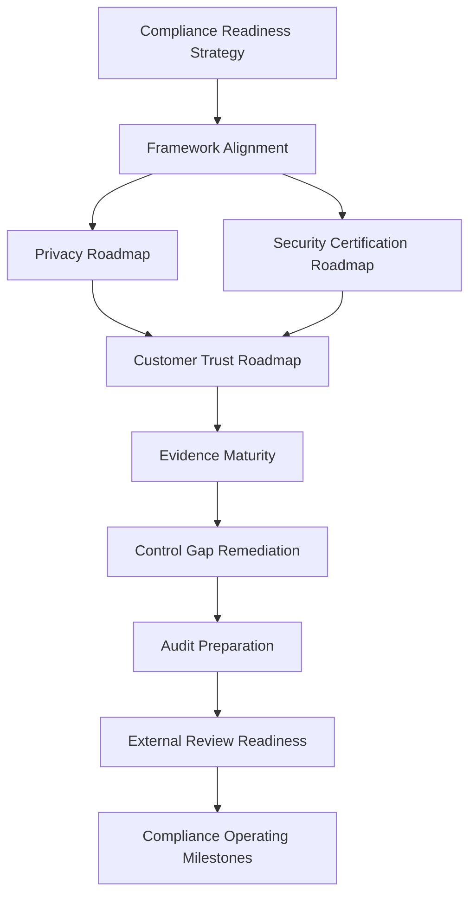

# PART-11 — Compliance Roadmap

> *"Compliance maturity is not a badge first. It is a system of controls, evidence, ownership, and trust that becomes ready for external proof."*

---

# Purpose

Part 11 defines CLARA's compliance roadmap.

It covers:

- Compliance Roadmap overview.
- Compliance Readiness Strategy.
- Framework Alignment Strategy.
- Privacy Compliance Roadmap.
- Security Certification Roadmap.
- Customer Trust Roadmap.
- Evidence Maturity Roadmap.
- Control Gap Remediation Roadmap.
- Audit Preparation Roadmap.
- External Review Readiness.
- Compliance Operating Milestones.

---

# Chapter Map

| Chapter | Title |
|---:|---|
| 121 | Compliance Roadmap Overview |
| 122 | Compliance Readiness Strategy |
| 123 | Framework Alignment Strategy |
| 124 | Privacy Compliance Roadmap |
| 125 | Security Certification Roadmap |
| 126 | Customer Trust Roadmap |
| 127 | Evidence Maturity Roadmap |
| 128 | Control Gap Remediation Roadmap |
| 129 | Audit Preparation Roadmap |
| 130 | External Review Readiness |
| 131 | Compliance Operating Milestones |
| 132 | Part 11 Summary |

---

# Compliance Roadmap Map



---

# Governance Non-Negotiables

CLARA compliance roadmap must enforce:

```text
no premature certification claims
evidence-backed customer answers
clear compliance scope
control ownership
privacy governance
risk-based gap remediation
external review boundaries
audit preparation before audit claims
customer trust materials reviewed before sharing
operating milestones with owners
```

---

# Compliance Readiness Disclaimer

This roadmap prepares CLARA for future compliance maturity.

It does not itself certify CLARA against any external framework.

Formal certification or regulated compliance decisions should involve qualified legal, compliance, and audit professionals.

---

# Relationship to Previous Parts

| Part | Contribution |
|---|---|
| Part 01 | Governance foundation |
| Part 02 | Policy layer |
| Part 03 | Identity/access governance |
| Part 04 | Data/privacy governance |
| Part 05 | AI governance |
| Part 06 | Third-party governance |
| Part 07 | Audit evidence readiness |
| Part 08 | Incident and continuity governance |
| Part 09 | Secure SDLC governance |
| Part 10 | Risk and control mapping |
| Part 11 | Compliance roadmap and maturity path |

---

# Navigation

**Previous:** `../PART-10-Risk-Register-and-Control-Mapping/120-Part-10-Summary.md`

**Next:** `121-Compliance-Roadmap-Overview.md`
