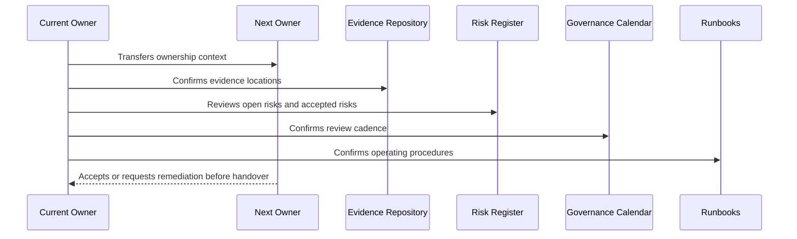

# Governance Handover and Operating Manual Overview

> *"Introduces CLARA's governance handover and operating manual for sustaining security, risk, compliance, evidence, ownership, reviews, and continuous improvement."*

---

# Purpose

Introduces CLARA's governance handover and operating manual for sustaining security, risk, compliance, evidence, ownership, reviews, and continuous improvement.

---

# Handover Problem

Governance fails when documents exist but nobody owns the routines, reviews, evidence, and decisions after handover.

---

# Governance Decision

## Decision

CLARA governance should be handed over as an operating system with owners, calendars, runbooks, evidence repositories, risk/control registers, and decision rituals.

## Status

Accepted.

---

# Handover Rule

Every governance area must be handed over as:

```text
Area -> Owner -> Backup Owner -> Current Status -> Evidence -> Open Gaps -> Review Cadence -> Runbook -> Escalation Path
```

A handover is incomplete if the next team cannot answer:

```text
what exists
who owns it
where evidence lives
what is risky
what must be reviewed next
how to operate it
how to escalate
```

---

# Recommended Handover Flow



---

# Secure-by-Design Checklist

- [ ] Primary owner is assigned.
- [ ] Backup owner is assigned for critical areas.
- [ ] Current status is documented.
- [ ] Evidence location is documented.
- [ ] Open risks/gaps are documented.
- [ ] Accepted risks and expiration dates are documented.
- [ ] Review cadence is scheduled.
- [ ] Runbook exists.
- [ ] Escalation path exists.
- [ ] Customer/external disclosure boundaries are documented where relevant.

---

# Acceptance Criteria

- [ ] Handover process is clear.
- [ ] Ownership is explicit.
- [ ] Evidence and risk locations are clear.
- [ ] Recurring reviews are scheduled.
- [ ] Runbooks are actionable.
- [ ] Book VI can be operated after handover.
- [ ] AI coding assistants can follow this safely.

---

# Anti-patterns

Avoid:

- Handover as a folder dump.
- No backup owner for critical governance.
- Open risks without owner/date.
- Evidence links missing or private to one person.
- Review calendar not created.
- Runbooks that only original author understands.
- Customer trust materials with no approval owner.
- Accepted risks with no expiration.
- Compliance roadmap with no operating milestones.
- Governance that is not connected to engineering work.

---

# Related Documents

- ../PART-01-Security-Governance-Foundation/README.md
- ../PART-07-Audit-Evidence-and-Compliance-Readiness/README.md
- ../PART-10-Risk-Register-and-Control-Mapping/README.md
- ../PART-11-Compliance-Roadmap/README.md
- ../../BOOK-05-Engineering-Execution-Plan/PART-12-Production-Readiness-and-Handover/README.md

---

# Navigation

**Previous:** `../PART-11-Compliance-Roadmap/132-Part-11-Summary.md`

**Next:** `134-Governance-Operating-Manual.md`

---

# Handover Scope

Book VI handover covers:

```text
security governance ownership
policy ownership
access governance reviews
data/privacy governance
AI governance
integration governance
evidence repository
incident governance
secure SDLC governance
risk register
control library
compliance roadmap
customer trust materials
governance calendar
runbooks
```

---

# Handover Acceptance Questions

The receiving team should ask:

```text
Can we find all governance docs?
Can we identify owners?
Can we operate reviews?
Can we answer customer security questions?
Can we update risks and controls?
Can we handle incidents?
Can we avoid overclaiming compliance?
```
