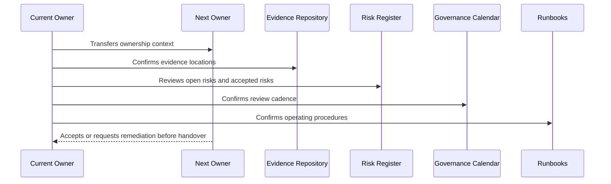

# Policy and Standards Handover

> *"Defines how CLARA policies and standards should be handed over, versioned, reviewed, updated, and enforced."*

---

# Purpose

Defines how CLARA policies and standards should be handed over, versioned, reviewed, updated, and enforced.

---

# Handover Problem

Policies become stale when no one owns their lifecycle or maps them to actual implementation changes.

---

# Governance Decision

## Decision

CLARA policy handover should make policy owners, review dates, control mappings, exception processes, and update procedures explicit.

## Status

Accepted.

---

# Handover Rule

Every governance area must be handed over as:

```text
Area -> Owner -> Backup Owner -> Current Status -> Evidence -> Open Gaps -> Review Cadence -> Runbook -> Escalation Path
```

A handover is incomplete if the next team cannot answer:

```text
what exists
who owns it
where evidence lives
what is risky
what must be reviewed next
how to operate it
how to escalate
```

---

# Recommended Handover Flow



---

# Secure-by-Design Checklist

- [ ] Primary owner is assigned.
- [ ] Backup owner is assigned for critical areas.
- [ ] Current status is documented.
- [ ] Evidence location is documented.
- [ ] Open risks/gaps are documented.
- [ ] Accepted risks and expiration dates are documented.
- [ ] Review cadence is scheduled.
- [ ] Runbook exists.
- [ ] Escalation path exists.
- [ ] Customer/external disclosure boundaries are documented where relevant.

---

# Acceptance Criteria

- [ ] Handover process is clear.
- [ ] Ownership is explicit.
- [ ] Evidence and risk locations are clear.
- [ ] Recurring reviews are scheduled.
- [ ] Runbooks are actionable.
- [ ] Book VI can be operated after handover.
- [ ] AI coding assistants can follow this safely.

---

# Anti-patterns

Avoid:

- Handover as a folder dump.
- No backup owner for critical governance.
- Open risks without owner/date.
- Evidence links missing or private to one person.
- Review calendar not created.
- Runbooks that only original author understands.
- Customer trust materials with no approval owner.
- Accepted risks with no expiration.
- Compliance roadmap with no operating milestones.
- Governance that is not connected to engineering work.

---

# Related Documents

- ../PART-01-Security-Governance-Foundation/README.md
- ../PART-07-Audit-Evidence-and-Compliance-Readiness/README.md
- ../PART-10-Risk-Register-and-Control-Mapping/README.md
- ../PART-11-Compliance-Roadmap/README.md
- ../../BOOK-05-Engineering-Execution-Plan/PART-12-Production-Readiness-and-Handover/README.md

---

# Navigation

**Previous:** `135-Security-Ownership-Handover.md`

**Next:** `137-Risk-and-Control-Handover.md`

---

# Policy Handover Checklist

- [ ] Policy list is complete.
- [ ] Each policy has owner.
- [ ] Each policy has review cadence.
- [ ] Policy exceptions are documented.
- [ ] Accepted risks are linked.
- [ ] Controls are mapped.
- [ ] Evidence is linked.
- [ ] Last review date is known.
- [ ] Next review date is scheduled.

---

# Policy Update Process

```text
identify need
draft update
review with owners
map impacted controls
approve change
publish version
communicate change
update evidence/checklists
```

---

# Policy Version Rule

Never silently edit governance policies without version/date/change summary.
