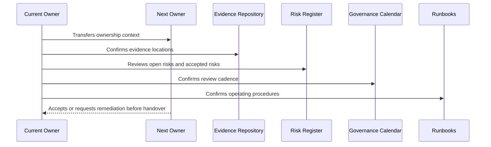

# Book VI Closure

> *"Closes Book VI and explains how Security, Governance & Compliance should be used with Books I–V and future books."*

---

# Purpose

Closes Book VI and explains how Security, Governance & Compliance should be used with Books I–V and future books.

---

# Handover Problem

If Book VI is not used during implementation and operations, security governance will drift away from the system being built.

---

# Governance Decision

## Decision

Book VI should become CLARA's governance reference for security decisions, access reviews, privacy reviews, AI governance, third-party governance, evidence, and compliance maturity.

## Status

Accepted.

---

# Handover Rule

Every governance area must be handed over as:

```text
Area -> Owner -> Backup Owner -> Current Status -> Evidence -> Open Gaps -> Review Cadence -> Runbook -> Escalation Path
```

A handover is incomplete if the next team cannot answer:

```text
what exists
who owns it
where evidence lives
what is risky
what must be reviewed next
how to operate it
how to escalate
```

---

# Recommended Handover Flow



---

# Secure-by-Design Checklist

- [ ] Primary owner is assigned.
- [ ] Backup owner is assigned for critical areas.
- [ ] Current status is documented.
- [ ] Evidence location is documented.
- [ ] Open risks/gaps are documented.
- [ ] Accepted risks and expiration dates are documented.
- [ ] Review cadence is scheduled.
- [ ] Runbook exists.
- [ ] Escalation path exists.
- [ ] Customer/external disclosure boundaries are documented where relevant.

---

# Acceptance Criteria

- [ ] Handover process is clear.
- [ ] Ownership is explicit.
- [ ] Evidence and risk locations are clear.
- [ ] Recurring reviews are scheduled.
- [ ] Runbooks are actionable.
- [ ] Book VI can be operated after handover.
- [ ] AI coding assistants can follow this safely.

---

# Anti-patterns

Avoid:

- Handover as a folder dump.
- No backup owner for critical governance.
- Open risks without owner/date.
- Evidence links missing or private to one person.
- Review calendar not created.
- Runbooks that only original author understands.
- Customer trust materials with no approval owner.
- Accepted risks with no expiration.
- Compliance roadmap with no operating milestones.
- Governance that is not connected to engineering work.

---

# Related Documents

- ../PART-01-Security-Governance-Foundation/README.md
- ../PART-07-Audit-Evidence-and-Compliance-Readiness/README.md
- ../PART-10-Risk-Register-and-Control-Mapping/README.md
- ../PART-11-Compliance-Roadmap/README.md
- ../../BOOK-05-Engineering-Execution-Plan/PART-12-Production-Readiness-and-Handover/README.md

---

# Navigation

**Previous:** `142-Governance-KPIs-and-Continuous-Improvement.md`

**Next:** `144-Part-12-Summary.md`

---

# How Book VI Should Be Used

Book VI should be used during:

```text
feature planning
security reviews
AI feature reviews
integration onboarding
access review
incident response
customer security review
release readiness
risk acceptance
compliance roadmap planning
```

---

# Relationship to Future Books

Book VI supports future books by ensuring CLARA's growth remains:

```text
secure
governed
audit-ready
privacy-aware
AI-safe
integration-aware
enterprise-ready
```

---

# Book VI Update Rule

Update Book VI when:

```text
policy changes
control ownership changes
new AI risk appears
new provider/integration is added
new compliance expectation appears
major incident happens
customer security review reveals a gap
governance operating rhythm changes
```
