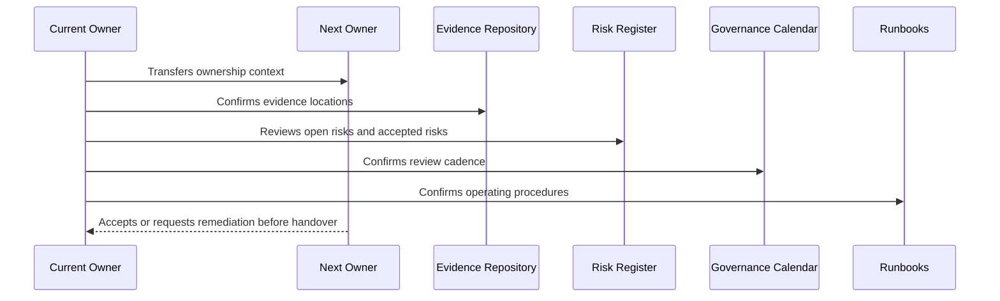

# Part 12 Summary

> *"Summarizes Governance Handover and Operating Manual and closes Book VI."*

---

# Purpose

Summarizes Governance Handover and Operating Manual and closes Book VI.

---

# Handover Problem

Without final handover, Book VI would remain a documentation set instead of an operating model.

---

# Governance Decision

## Decision

CLARA Book VI is complete when the governance foundation, policies, access governance, data privacy, AI, integrations, audit readiness, incident response, secure SDLC, risk/control mapping, compliance roadmap, and handover manual are defined.

## Status

Accepted.

---

# Handover Rule

Every governance area must be handed over as:

```text
Area -> Owner -> Backup Owner -> Current Status -> Evidence -> Open Gaps -> Review Cadence -> Runbook -> Escalation Path
```

A handover is incomplete if the next team cannot answer:

```text
what exists
who owns it
where evidence lives
what is risky
what must be reviewed next
how to operate it
how to escalate
```

---

# Recommended Handover Flow



---

# Secure-by-Design Checklist

- [ ] Primary owner is assigned.
- [ ] Backup owner is assigned for critical areas.
- [ ] Current status is documented.
- [ ] Evidence location is documented.
- [ ] Open risks/gaps are documented.
- [ ] Accepted risks and expiration dates are documented.
- [ ] Review cadence is scheduled.
- [ ] Runbook exists.
- [ ] Escalation path exists.
- [ ] Customer/external disclosure boundaries are documented where relevant.

---

# Acceptance Criteria

- [ ] Handover process is clear.
- [ ] Ownership is explicit.
- [ ] Evidence and risk locations are clear.
- [ ] Recurring reviews are scheduled.
- [ ] Runbooks are actionable.
- [ ] Book VI can be operated after handover.
- [ ] AI coding assistants can follow this safely.

---

# Anti-patterns

Avoid:

- Handover as a folder dump.
- No backup owner for critical governance.
- Open risks without owner/date.
- Evidence links missing or private to one person.
- Review calendar not created.
- Runbooks that only original author understands.
- Customer trust materials with no approval owner.
- Accepted risks with no expiration.
- Compliance roadmap with no operating milestones.
- Governance that is not connected to engineering work.

---

# Related Documents

- ../PART-01-Security-Governance-Foundation/README.md
- ../PART-07-Audit-Evidence-and-Compliance-Readiness/README.md
- ../PART-10-Risk-Register-and-Control-Mapping/README.md
- ../PART-11-Compliance-Roadmap/README.md
- ../../BOOK-05-Engineering-Execution-Plan/PART-12-Production-Readiness-and-Handover/README.md

---

# Navigation

**Previous:** `143-Book-VI-Closure.md`

**Next:** `../BOOK-06-Master-Index/README.md`

---

# Part 12 Completion

Part 12 establishes:

- Governance handover and operating manual overview.
- Governance operating manual.
- Security ownership handover.
- Policy and standards handover.
- Risk and control handover.
- Evidence and audit handover.
- Compliance roadmap handover.
- Review cadence calendar.
- Governance runbooks.
- Governance KPIs and continuous improvement.
- Book VI closure.

---

# Book VI Complete

Book VI now defines how CLARA should govern:

```text
security
risk
access
data protection
privacy
AI
integrations
third parties
audit evidence
incident response
business continuity
secure SDLC
controls
compliance roadmap
governance handover
```

---

# Recommended Next Artifact

The next recommended artifact is:

```text
BOOK-06 Master Index
```

It should map:

```text
all Book VI parts
all chapters 01–144
governance dependency map
policy map
risk/control map
evidence map
compliance roadmap map
operating cadence map
next steps toward Book VII
```
