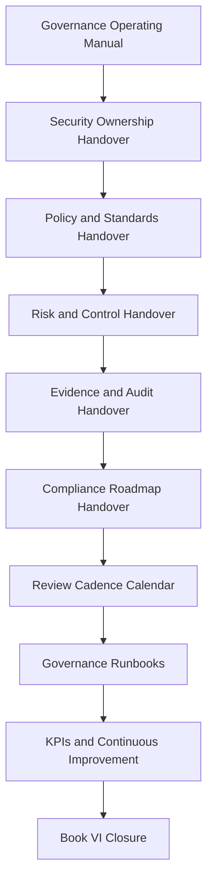

# PART-12 — Governance Handover and Operating Manual

> *"Governance is not complete when it is written. Governance is complete when it can be operated by the next responsible team."*

---

# Purpose

Part 12 defines CLARA's governance handover and operating manual.

It covers:

- Governance Handover and Operating Manual overview.
- Governance Operating Manual.
- Security Ownership Handover.
- Policy and Standards Handover.
- Risk and Control Handover.
- Evidence and Audit Handover.
- Compliance Roadmap Handover.
- Review Cadence Calendar.
- Governance Runbooks.
- Governance KPIs and Continuous Improvement.
- Book VI Closure.

---

# Chapter Map

| Chapter | Title |
|---:|---|
| 133 | Governance Handover and Operating Manual Overview |
| 134 | Governance Operating Manual |
| 135 | Security Ownership Handover |
| 136 | Policy and Standards Handover |
| 137 | Risk and Control Handover |
| 138 | Evidence and Audit Handover |
| 139 | Compliance Roadmap Handover |
| 140 | Review Cadence Calendar |
| 141 | Governance Runbooks |
| 142 | Governance KPIs and Continuous Improvement |
| 143 | Book VI Closure |
| 144 | Part 12 Summary |

---

# Governance Handover Map



---

# Governance Handover Non-Negotiables

CLARA governance handover must include:

```text
named owners
backup owners for critical areas
policy owners
risk register owner
control library owner
evidence repository owner
review cadence calendar
governance runbooks
open risks and gaps
accepted risks and expiration dates
customer evidence boundaries
incident escalation path
continuous improvement loop
```

---

# Relationship to Book VI

Part 12 operationalizes the previous parts:

| Previous Part | Handover Output |
|---|---|
| Part 01 | Governance owners and operating model |
| Part 02 | Policy ownership and review |
| Part 03 | Access governance calendar |
| Part 04 | Data/privacy governance ownership |
| Part 05 | AI governance ownership |
| Part 06 | Third-party governance ownership |
| Part 07 | Evidence and audit repository |
| Part 08 | Incident and continuity runbooks |
| Part 09 | Secure SDLC review gates |
| Part 10 | Risk/control register |
| Part 11 | Compliance roadmap |

---

# Navigation

**Previous:** `../PART-11-Compliance-Roadmap/132-Part-11-Summary.md`

**Next:** `133-Governance-Handover-and-Operating-Manual-Overview.md`
