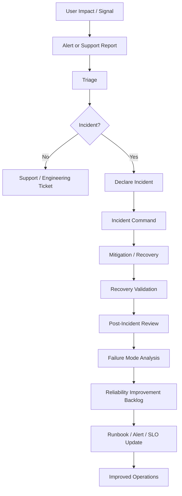

# BOOK-07 Incident and Reliability Map

> *"Incidents reveal reliability truth. Reliability engineering turns that truth into stronger systems."*

---

# Purpose

This document maps the relationship between alerting, incidents, reliability engineering, performance/capacity, backup/restore, runbooks, and SLOs.

---

# Incident and Reliability Flow



---

# Related Book VII Parts

```text
PART-04 Alerting and Incident Operations
PART-05 Reliability Engineering
PART-06 Performance and Capacity
PART-07 Backup, Restore, and Disaster Recovery
PART-09 Runbooks and Playbooks
PART-10 SLOs, SLIs, and Error Budgets
```

---

# Incident Operating Checklist

- [ ] Alert/support report is acknowledged.
- [ ] Customer impact is assessed.
- [ ] Severity is assigned.
- [ ] Incident is declared when criteria match.
- [ ] Incident commander is assigned.
- [ ] Timeline is maintained.
- [ ] Evidence is preserved.
- [ ] Mitigation is tracked.
- [ ] Recovery is validated.
- [ ] Follow-up actions are owned.

---

# Reliability Improvement Sources

```text
incidents
SLO violations
support trends
capacity reviews
AI quality failures
integration failures
queue backlog trends
database slow query reviews
security incidents
restore test failures
```

---

# Reliability Rule

Every serious incident should produce at least one of:

```text
code fix
test improvement
alert tuning
runbook update
dashboard improvement
SLO adjustment
capacity action
recovery procedure improvement
security control improvement
support communication improvement
```
