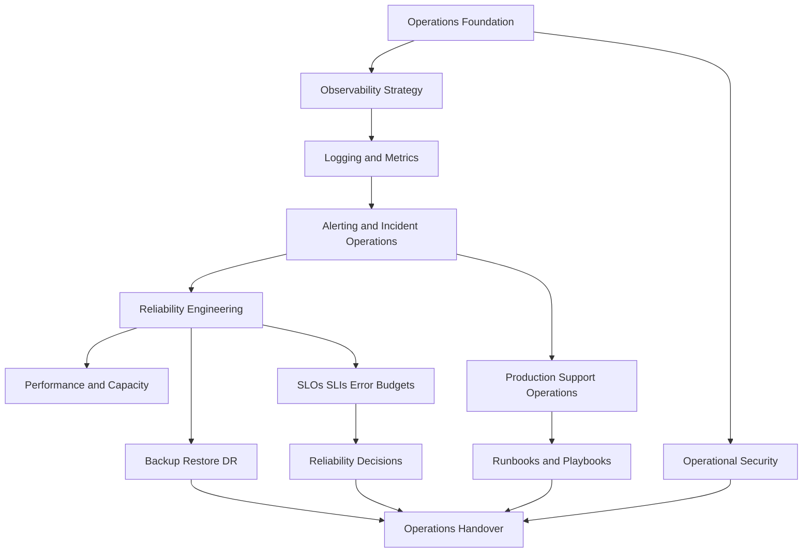

# BOOK-07 Master Index

> *"Operations are not a final phase. Operations are the proof that engineering decisions survive production reality."*

---

# Book Identity

```text
Book: Book VII
Title: Operations, Observability & Reliability
Project: CLARA
Status: Complete
Version: 1.0.0
Chapters: 01–144
Parts: 12
```

---

# Purpose

Book VII defines how CLARA should be operated in production.

It connects:

```text
service ownership
observability
logging and metrics
alerting
incident response
reliability engineering
performance and capacity
backup/restore/DR
production support
runbooks and playbooks
SLOs and error budgets
operational security
handover and review cadence
```

---

# Book VII Part Index

| Part | Title | Chapters | Link | Purpose |
|---|---|---:|---|---|
| PART-01 | Operations Foundation | 01-12 | [PART-01-Operations-Foundation/README.md](../PART-01-Operations-Foundation/README.md) | Defines production operating model, service ownership, readiness, RACI, operations cadence, and evidence reporting. |
| PART-02 | Observability Strategy | 13-24 | [PART-02-Observability-Strategy/README.md](../PART-02-Observability-Strategy/README.md) | Defines telemetry architecture, logs/metrics/traces strategy, dashboards, alert philosophy, user-impact observability, AI observability, and privacy boundaries. |
| PART-03 | Logging and Metrics | 25-36 | [PART-03-Logging-and-Metrics/README.md](../PART-03-Logging-and-Metrics/README.md) | Defines structured logging, event taxonomy, metrics naming, API/database/queue/AI/integration/business metrics, and retention/security rules. |
| PART-04 | Alerting and Incident Operations | 37-48 | [PART-04-Alerting-and-Incident-Operations/README.md](../PART-04-Alerting-and-Incident-Operations/README.md) | Defines alert strategy, severity, routing, on-call workflow, incident declaration, command, escalation, evidence, alert tuning, and follow-up. |
| PART-05 | Reliability Engineering | 49-60 | [PART-05-Reliability-Engineering/README.md](../PART-05-Reliability-Engineering/README.md) | Defines reliability principles, critical journeys, failure analysis, graceful degradation, timeouts/retries, idempotency, dependencies, queues, AI/integration reliability, and roadmap. |
| PART-06 | Performance and Capacity | 61-72 | [PART-06-Performance-and-Capacity/README.md](../PART-06-Performance-and-Capacity/README.md) | Defines performance principles, capacity planning, API/database/frontend performance, queue throughput, AI latency/cost, integration throughput, load testing, and budgets. |
| PART-07 | Backup, Restore, and Disaster Recovery | 73-84 | [PART-07-Backup-Restore-and-Disaster-Recovery/README.md](../PART-07-Backup-Restore-and-Disaster-Recovery/README.md) | Defines backup principles, recovery scope, schedules, restore testing, RTO/RPO, database/file/config recovery, DR scenarios, runbooks, and evidence. |
| PART-08 | Production Support Operations | 85-96 | [PART-08-Production-Support-Operations/README.md](../PART-08-Production-Support-Operations/README.md) | Defines support operating model, customer impact triage, escalation, tooling boundaries, incident coordination, known issues, customer comms, evidence, and readiness. |
| PART-09 | Runbooks and Playbooks | 97-108 | [PART-09-Runbooks-and-Playbooks/README.md](../PART-09-Runbooks-and-Playbooks/README.md) | Defines runbook architecture, templates, incident playbooks, service/AI/integration/database/queue/support/recovery runbooks, and review cadence. |
| PART-10 | SLOs, SLIs, and Error Budgets | 109-120 | [PART-10-SLOs-SLIs-and-Error-Budgets/README.md](../PART-10-SLOs-SLIs-and-Error-Budgets/README.md) | Defines SLO principles, SLI selection, critical journey SLOs, availability/latency/correctness SLOs, error budgets, SLO alerting, policy, and reporting. |
| PART-11 | Operational Security | 121-132 | [PART-11-Operational-Security/README.md](../PART-11-Operational-Security/README.md) | Defines production access, secrets operations, secure deployment, runtime hardening, security monitoring, vulnerability operations, incident coordination, evidence, and review cadence. |
| PART-12 | Operations Handover and Master Index | 133-144 | [PART-12-Operations-Handover-and-Master-Index/README.md](../PART-12-Operations-Handover-and-Master-Index/README.md) | Defines operations handover, service ownership transfer, observability/incident/reliability/support/runbook/security handover, cadence, evidence, and closure. |

---

# Master Operating Model



---

# How to Use Book VII

Use Book VII during:

```text
production readiness review
service ownership assignment
dashboard design
log/metric implementation
alert creation
incident response
post-incident review
reliability roadmap planning
capacity planning
restore drills
support escalation design
runbook creation
SLO/error budget review
security operations review
handover
```

---

# Production-Ready Definition

For CLARA, a service or capability is production-ready only when it has:

```text
owner
backup owner
observability
logs and metrics
alerts where needed
incident path
runbook
support escalation path
SLO where critical
security controls
backup/recovery path where data/stateful
review cadence
handover record
```

---

# Operating Principle

```text
If it can affect customers in production, it needs ownership, observability, supportability, recoverability, and secure operations.
```

---

# Next

Continue to:

```text
BOOK-07-CHAPTER-MAP.md
```
