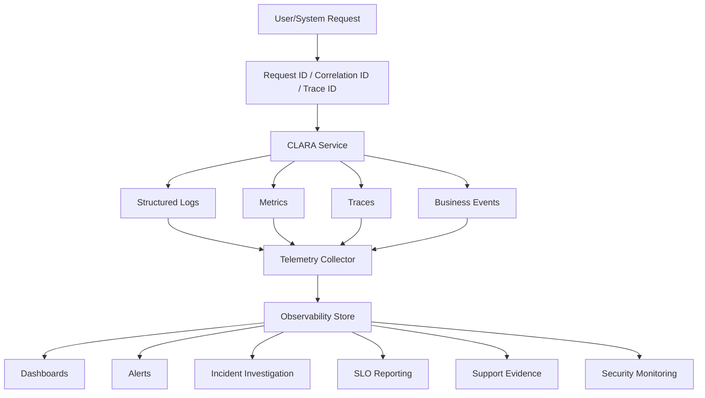

# BOOK-07 Observability Map

> *"Observability lets operators understand production behavior without guessing."*

---

# Purpose

This document maps CLARA observability concepts across Book VII.

---

# Observability Architecture



---

# Core Observability Documents

```text
PART-02 Observability Strategy
PART-03 Logging and Metrics
PART-04 Alerting and Incident Operations
PART-10 SLOs, SLIs, and Error Budgets
PART-11 Operational Security
```

---

# Required Signal Types

CLARA should observe:

```text
API latency and error rates
database query latency and errors
queue backlog and worker health
AI provider latency/error/safety/cost
integration webhook lifecycle
business workflow success/failure
customer impact signals
security-relevant events
deployment and release events
SLO burn rate
```

---

# Observability Security Rules

```text
do not log secrets
do not log raw sensitive customer data by default
redact tokens and credentials
avoid high-cardinality metric labels
protect telemetry access
audit access to sensitive operational evidence
separate environment telemetry where practical
```

---

# Observability Acceptance Criteria

- [ ] Critical requests have correlation IDs.
- [ ] Logs are structured.
- [ ] Metrics use consistent naming.
- [ ] Dashboards answer operational questions.
- [ ] Alerts are actionable.
- [ ] Telemetry supports incidents and support.
- [ ] Sensitive data is protected.
- [ ] SLO reporting is possible.
