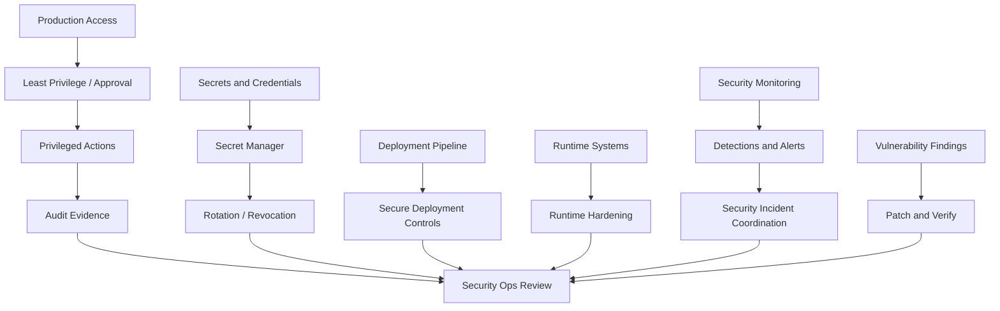

# BOOK-07 Operational Security Map

> *"Operational security protects the control plane of production."*

---

# Purpose

This document maps operational security across production access, secrets, deployments, runtime hardening, monitoring, vulnerability operations, incidents, evidence, and review cadence.

---

# Operational Security Flow



---

# Core Operational Security Controls

```text
least privilege production access
no shared accounts
break-glass process
service account ownership
secret manager usage
secret rotation and revocation
secure CI/CD
environment separation
runtime hardening
security monitoring
vulnerability remediation
security incident coordination
operational audit evidence
review cadence
```

---

# High-Risk Operations

Require strong controls for:

```text
database console access
manual data mutation
secret access or rotation
backup/restore operation
production shell access
deployment approval
feature flag emergency override
customer data export
security incident containment
dead-letter replay with side effects
```

---

# Evidence Requirements

Track:

```text
access reviews
privileged action logs
break-glass usage
secret rotations
deployment approvals
vulnerability remediation
security detections
incident timelines
runtime hardening reviews
patch verification
```

---

# Security Rule

Do not make operations easier by making production access broader.
