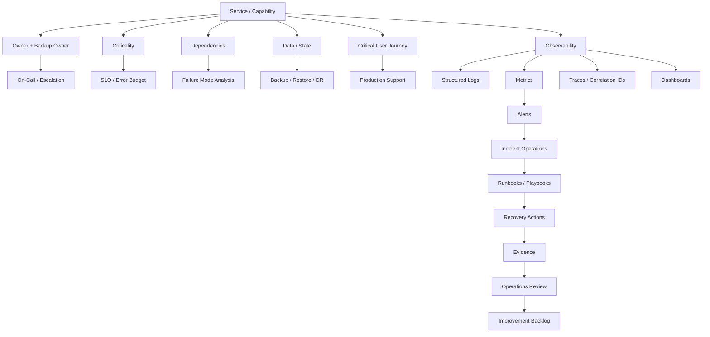

# BOOK-07 Operations Dependency Map

> *"Operations are a system of dependencies: ownership, visibility, response, recovery, and improvement."*

---

# Purpose

This document maps operational dependencies across Book VII.

---

# Dependency Map



---

# Required Operational Dependencies

Every production-critical capability should define:

```text
owner
backup owner
business purpose
criticality
critical user journey
dependencies
data/state owned
dashboard
logs
metrics
traces/correlation IDs
alerts
runbook
incident escalation path
support escalation path
SLO/error budget where critical
backup/restore path where stateful
operational security controls
review cadence
```

---

# Operational Dependency Checklist

- [ ] Owner and backup owner are assigned.
- [ ] Critical workflows are identified.
- [ ] Dependencies are documented.
- [ ] Data/state ownership is clear.
- [ ] Observability exists.
- [ ] Alerts are actionable.
- [ ] Incident path is documented.
- [ ] Runbook exists.
- [ ] Support path exists.
- [ ] Recovery path exists.
- [ ] Security controls are documented.
- [ ] Review cadence exists.

---

# Anti-patterns

Avoid:

```text
service with no owner
dashboard with no decision purpose
alert with no runbook
SLO with no policy
support escalation with no engineering owner
backup with no restore test
secret with no owner
runbook with no review cadence
```
