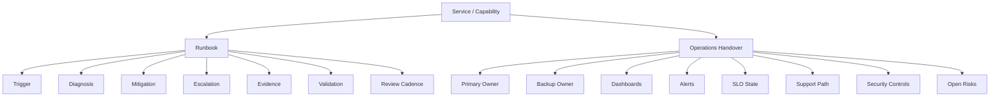

# BOOK-07 Runbook and Handover Map

> *"A system is truly handed over only when the next owner can operate it safely."*

---

# Purpose

This document maps CLARA's runbook and operations handover model.

---

# Runbook and Handover Flow



---

# Required Runbook Types

```text
service runbooks
incident playbooks
AI operations runbooks
integration/webhook runbooks
database runbooks
queue/worker runbooks
support playbooks
recovery/DR playbooks
deployment recovery runbooks
known issue playbooks
```

---

# Runbook Quality Checklist

- [ ] Trigger is clear.
- [ ] Owner is current.
- [ ] Required access is clear.
- [ ] Safety warnings are explicit.
- [ ] Dashboards/logs/metrics are linked.
- [ ] Diagnosis steps are actionable.
- [ ] Mitigation steps are safe.
- [ ] Escalation path exists.
- [ ] Evidence capture is defined.
- [ ] Validation step confirms recovery.
- [ ] Last reviewed date is current.

---

# Handover Checklist

- [ ] Owner and backup owner assigned.
- [ ] Service/capability status documented.
- [ ] Dashboards and alerts linked.
- [ ] Runbooks/playbooks linked.
- [ ] Known risks documented.
- [ ] SLO/error budget state transferred.
- [ ] Support escalation path transferred.
- [ ] Security/access reviewed.
- [ ] Evidence location transferred.
- [ ] Next review date scheduled.

---

# Handover Rule

A handover is not complete until the receiving owner accepts operational responsibility with evidence and open risks understood.
