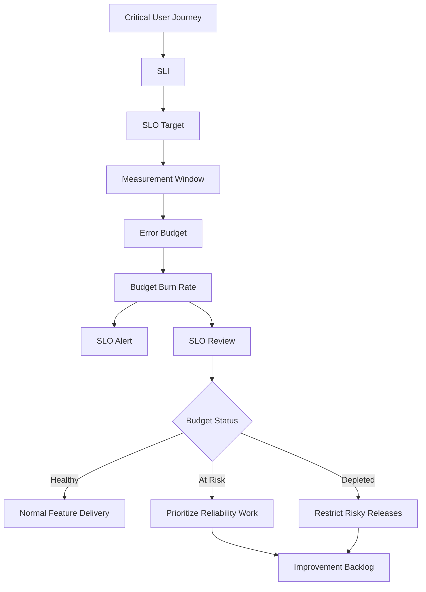

# BOOK-07 SLO and Error Budget Map

> *"SLOs turn reliability from an opinion into an operating decision."*

---

# Purpose

This document maps CLARA's SLO, SLI, and error budget model.

---

# SLO Operating Flow



---

# Initial CLARA SLO Candidates

```text
login success rate
inbox load success and latency
conversation open success and latency
reply send success
ticket update success
AI draft generation success and latency
integration ingestion success and delay
attachment upload/download success
export completion success and delay
```

---

# SLI Categories

```text
availability / success ratio
latency percentile
freshness / delay
correctness
quality
durability / recovery
```

---

# Error Budget Policy States

| State | Meaning | Expected Behavior |
|---|---|---|
| Healthy | Budget available | Normal delivery |
| Watch | Burn increasing | Investigate trend |
| At Risk | Budget may deplete | Prioritize reliability |
| Depleted | SLO violation likely/actual | Restrict risky releases |
| Repeated Violation | Systemic reliability issue | Reliability roadmap required |

---

# SLO Review Checklist

- [ ] SLI still represents user experience.
- [ ] Target is realistic.
- [ ] Measurement is reliable.
- [ ] Dashboard is current.
- [ ] Error budget state is visible.
- [ ] Incidents are linked.
- [ ] Top failure causes are known.
- [ ] Policy actions were followed.
- [ ] Next improvements are owned.
