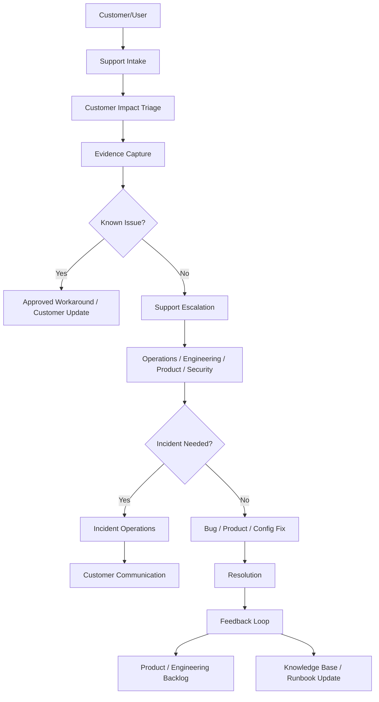

# BOOK-07 Support Operations Map

> *"Support is where production reality meets customer experience."*

---

# Purpose

This document maps how production support connects to operations, incidents, reliability, and product improvement.

---

# Support Operations Flow



---

# Related Book VII Parts

```text
PART-08 Production Support Operations
PART-04 Alerting and Incident Operations
PART-09 Runbooks and Playbooks
PART-05 Reliability Engineering
PART-11 Operational Security
```

---

# Support Readiness Definition

A feature is support-ready when support has:

```text
feature summary
expected workflow
known failure modes
triage questions
evidence checklist
safe troubleshooting steps
escalation owner
approved customer communication
security/privacy notes
known limitations
runbook/playbook link
```

---

# Support Security Boundaries

Support tooling must respect:

```text
least privilege
tenant/workspace boundaries
data minimization
audit logging for sensitive actions
no unrestricted database access by default
no raw secrets access
no unsafe impersonation
clear approval for privileged support actions
```

---

# Support Feedback Rule

Recurring support pain should become:

```text
product improvement
engineering fix
documentation update
runbook update
alert/dashboard improvement
known issue record
training/support macro
```
