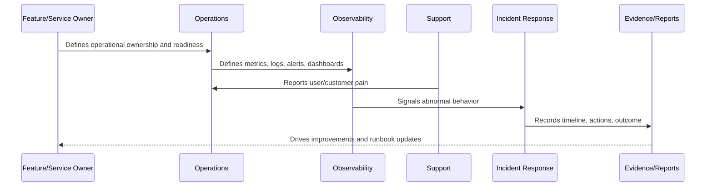

# Book VII Overview

> *"Introduces Book VII as CLARA's production operations, observability, reliability, support, and resilience operating guide."*

---

# Purpose

Introduces Book VII as CLARA's production operations, observability, reliability, support, and resilience operating guide.

---

# Operational Problem

A production system can fail even when the code is correct if operations, observability, ownership, and recovery processes are weak.

---

# Operational Decision

## Decision

CLARA should treat production operations as a first-class engineering discipline, not as an afterthought after features are shipped.

## Status

Accepted.

---

# Operations Rule

Every production capability in CLARA must be operated as:

```text
Capability -> Owner -> Health Signal -> Alert/Review Path -> Runbook -> Evidence -> Improvement Loop
```

A feature is not production-ready if the team cannot answer:

```text
who owns it
how to observe it
how to detect failure
how to recover it
how to support users
how to prove what happened
how to improve after failure
```

---

# Recommended Operations Flow



---

# Production-Ready Checklist

- [ ] Owner is assigned.
- [ ] Backup/escalation owner is defined where critical.
- [ ] Health signal is defined.
- [ ] Logs/metrics/traces are defined where relevant.
- [ ] Alerts or review signals are defined.
- [ ] Runbook exists.
- [ ] Fallback/recovery path exists.
- [ ] Support impact is understood.
- [ ] Evidence/reporting source is defined.
- [ ] Security and data boundaries are respected.

---

# Acceptance Criteria

- [ ] Operational responsibility is clear.
- [ ] Monitoring/observability expectations are clear.
- [ ] Failure handling is clear.
- [ ] Support escalation is clear.
- [ ] Evidence expectations are clear.
- [ ] Continuous improvement loop is clear.
- [ ] AI coding assistants can follow this safely.

---

# Anti-patterns

Avoid:

- Shipping production features without owners.
- Alerts with no responder.
- Dashboards nobody uses.
- Logs that expose secrets/customer data.
- Runbooks that only one engineer understands.
- No rollback or disable path.
- No support escalation process.
- Measuring uptime without user-impact context.
- Treating AI/integrations as normal low-risk services.
- Fixing incidents without improving docs/tests/alerts.

---

# Related Documents

- ../../BOOK-06-Security-Governance-and-Compliance/BOOK-06-Master-Index/README.md
- ../../BOOK-06-Security-Governance-and-Compliance/PART-08-Incident-Response-and-Business-Continuity-Governance/README.md
- ../../BOOK-06-Security-Governance-and-Compliance/PART-09-Secure-SDLC-Governance/README.md
- ../../BOOK-05-Engineering-Execution-Plan/PART-10-DevOps-and-Release-Execution/README.md
- ../../BOOK-05-Engineering-Execution-Plan/PART-12-Production-Readiness-and-Handover/README.md

---

# Navigation

**Previous:** `../../BOOK-06-Security-Governance-and-Compliance/BOOK-06-Master-Index/BOOK-06-NEXT-STEPS.md`

**Next:** `02-Operations-Principles.md`

---

# Book VII Recommended Structure

```text
PART-01 Operations Foundation
PART-02 Observability Strategy
PART-03 Logging and Metrics
PART-04 Alerting and Incident Operations
PART-05 Reliability Engineering
PART-06 Performance and Capacity
PART-07 Backup, Restore, and Disaster Recovery
PART-08 Production Support Operations
PART-09 Runbooks and Playbooks
PART-10 SLOs, SLIs, and Error Budgets
PART-11 Operational Security
PART-12 Operations Handover and Master Index
```

---

# Core Book VII Question

```text
Can CLARA be operated reliably, observed clearly, recovered quickly, supported effectively, and improved continuously?
```

---

# Production Reality

In production, CLARA must handle:

```text
traffic spikes
slow database queries
failed deployments
provider outages
AI provider latency/cost spikes
webhook floods
queue backlogs
customer support escalation
data recovery needs
security alerts
```
