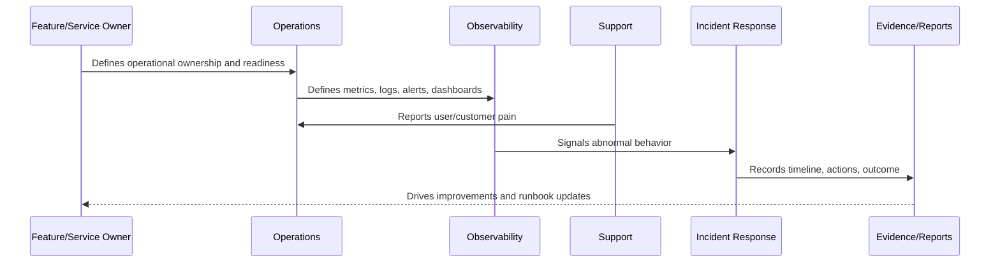

# Operations Principles

> *"Defines the core principles for operating CLARA safely, reliably, observably, securely, and sustainably in production."*

---

# Purpose

Defines the core principles for operating CLARA safely, reliably, observably, securely, and sustainably in production.

---

# Operational Problem

Without shared principles, operational decisions become inconsistent and reactive.

---

# Operational Decision

## Decision

CLARA operations should be guided by ownership, visibility, safe change, fast recovery, evidence, automation, and continuous improvement.

## Status

Accepted.

---

# Operations Rule

Every production capability in CLARA must be operated as:

```text
Capability -> Owner -> Health Signal -> Alert/Review Path -> Runbook -> Evidence -> Improvement Loop
```

A feature is not production-ready if the team cannot answer:

```text
who owns it
how to observe it
how to detect failure
how to recover it
how to support users
how to prove what happened
how to improve after failure
```

---

# Recommended Operations Flow



---

# Production-Ready Checklist

- [ ] Owner is assigned.
- [ ] Backup/escalation owner is defined where critical.
- [ ] Health signal is defined.
- [ ] Logs/metrics/traces are defined where relevant.
- [ ] Alerts or review signals are defined.
- [ ] Runbook exists.
- [ ] Fallback/recovery path exists.
- [ ] Support impact is understood.
- [ ] Evidence/reporting source is defined.
- [ ] Security and data boundaries are respected.

---

# Acceptance Criteria

- [ ] Operational responsibility is clear.
- [ ] Monitoring/observability expectations are clear.
- [ ] Failure handling is clear.
- [ ] Support escalation is clear.
- [ ] Evidence expectations are clear.
- [ ] Continuous improvement loop is clear.
- [ ] AI coding assistants can follow this safely.

---

# Anti-patterns

Avoid:

- Shipping production features without owners.
- Alerts with no responder.
- Dashboards nobody uses.
- Logs that expose secrets/customer data.
- Runbooks that only one engineer understands.
- No rollback or disable path.
- No support escalation process.
- Measuring uptime without user-impact context.
- Treating AI/integrations as normal low-risk services.
- Fixing incidents without improving docs/tests/alerts.

---

# Related Documents

- ../../BOOK-06-Security-Governance-and-Compliance/BOOK-06-Master-Index/README.md
- ../../BOOK-06-Security-Governance-and-Compliance/PART-08-Incident-Response-and-Business-Continuity-Governance/README.md
- ../../BOOK-06-Security-Governance-and-Compliance/PART-09-Secure-SDLC-Governance/README.md
- ../../BOOK-05-Engineering-Execution-Plan/PART-10-DevOps-and-Release-Execution/README.md
- ../../BOOK-05-Engineering-Execution-Plan/PART-12-Production-Readiness-and-Handover/README.md

---

# Navigation

**Previous:** `01-Book-VII-Overview.md`

**Next:** `03-Production-Operating-Model.md`

---

# Core Principles

CLARA operations should follow:

```text
ownership over heroics
observability over guessing
safe change over fast chaos
fast recovery over perfect prevention
evidence over memory
automation over repeated manual work
continuous improvement over blame
security by default
privacy-aware operations
customer impact awareness
```

---

# Principle Translation

| Principle | Practical Meaning |
|---|---|
| Ownership | Every critical capability has a named owner |
| Observability | Failures are visible before customers scream |
| Safe Change | Deployments have gates and rollback/disable paths |
| Fast Recovery | Teams can restore service quickly |
| Evidence | Incidents and reviews are based on facts |
| Improvement | Every significant failure improves the system |

---

# Operations Mindset

Production operations is not just “keeping servers alive.”

It is keeping customer outcomes reliable.
