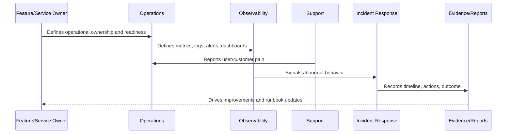

# Operations Evidence and Reporting

> *"Defines evidence and reporting expectations for operational health, reliability, incidents, alerts, deployments, runbooks, and support outcomes."*

---

# Purpose

Defines evidence and reporting expectations for operational health, reliability, incidents, alerts, deployments, runbooks, and support outcomes.

---

# Operational Problem

Without operational evidence, teams cannot tell whether reliability is improving or simply lucky.

---

# Operational Decision

## Decision

CLARA should preserve operational evidence that helps debug incidents, prove reliability, support customer trust, and guide improvement.

## Status

Accepted.

---

# Operations Rule

Every production capability in CLARA must be operated as:

```text
Capability -> Owner -> Health Signal -> Alert/Review Path -> Runbook -> Evidence -> Improvement Loop
```

A feature is not production-ready if the team cannot answer:

```text
who owns it
how to observe it
how to detect failure
how to recover it
how to support users
how to prove what happened
how to improve after failure
```

---

# Recommended Operations Flow



---

# Production-Ready Checklist

- [ ] Owner is assigned.
- [ ] Backup/escalation owner is defined where critical.
- [ ] Health signal is defined.
- [ ] Logs/metrics/traces are defined where relevant.
- [ ] Alerts or review signals are defined.
- [ ] Runbook exists.
- [ ] Fallback/recovery path exists.
- [ ] Support impact is understood.
- [ ] Evidence/reporting source is defined.
- [ ] Security and data boundaries are respected.

---

# Acceptance Criteria

- [ ] Operational responsibility is clear.
- [ ] Monitoring/observability expectations are clear.
- [ ] Failure handling is clear.
- [ ] Support escalation is clear.
- [ ] Evidence expectations are clear.
- [ ] Continuous improvement loop is clear.
- [ ] AI coding assistants can follow this safely.

---

# Anti-patterns

Avoid:

- Shipping production features without owners.
- Alerts with no responder.
- Dashboards nobody uses.
- Logs that expose secrets/customer data.
- Runbooks that only one engineer understands.
- No rollback or disable path.
- No support escalation process.
- Measuring uptime without user-impact context.
- Treating AI/integrations as normal low-risk services.
- Fixing incidents without improving docs/tests/alerts.

---

# Related Documents

- ../../BOOK-06-Security-Governance-and-Compliance/BOOK-06-Master-Index/README.md
- ../../BOOK-06-Security-Governance-and-Compliance/PART-08-Incident-Response-and-Business-Continuity-Governance/README.md
- ../../BOOK-06-Security-Governance-and-Compliance/PART-09-Secure-SDLC-Governance/README.md
- ../../BOOK-05-Engineering-Execution-Plan/PART-10-DevOps-and-Release-Execution/README.md
- ../../BOOK-05-Engineering-Execution-Plan/PART-12-Production-Readiness-and-Handover/README.md

---

# Navigation

**Previous:** `10-Operations-Cadence-and-Review-Rhythm.md`

**Next:** `12-Part-01-Summary.md`

---

# Operations Evidence

Track:

```text
deployment history
release checklists
smoke test results
incident timelines
postmortems
alert history
dashboard snapshots/references
runbook updates
backup/restore test results
capacity review notes
support escalation summaries
provider incident references
```

---

# Reporting Views

Useful reports:

```text
weekly operations summary
monthly reliability review
incident trend report
deployment stability report
support escalation report
provider health report
AI operations report
```

---

# Evidence Rule

Operational evidence should help the team answer:

```text
what happened
why it happened
who responded
how users were affected
how it was fixed
what changed afterward
```
