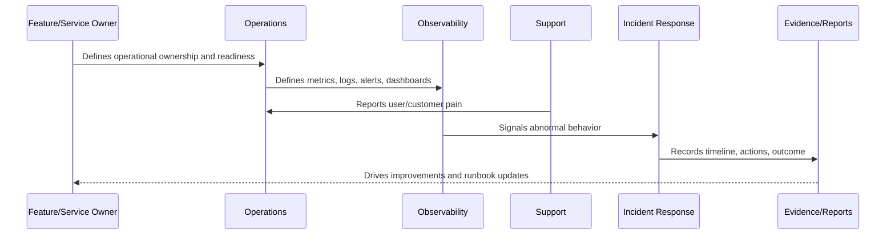

# Part 01 Summary

> *"Summarizes Operations Foundation and prepares for Book VII Part 02."*

---

# Purpose

Summarizes Operations Foundation and prepares for Book VII Part 02.

---

# Operational Problem

Observability strategy depends on a clear operations foundation because monitoring must serve real owners, decisions, and response workflows.

---

# Operational Decision

## Decision

CLARA should proceed to Observability Strategy after establishing operations principles, ownership, readiness, runbook standards, roles, cadence, and evidence.

## Status

Accepted.

---

# Operations Rule

Every production capability in CLARA must be operated as:

```text
Capability -> Owner -> Health Signal -> Alert/Review Path -> Runbook -> Evidence -> Improvement Loop
```

A feature is not production-ready if the team cannot answer:

```text
who owns it
how to observe it
how to detect failure
how to recover it
how to support users
how to prove what happened
how to improve after failure
```

---

# Recommended Operations Flow



---

# Production-Ready Checklist

- [ ] Owner is assigned.
- [ ] Backup/escalation owner is defined where critical.
- [ ] Health signal is defined.
- [ ] Logs/metrics/traces are defined where relevant.
- [ ] Alerts or review signals are defined.
- [ ] Runbook exists.
- [ ] Fallback/recovery path exists.
- [ ] Support impact is understood.
- [ ] Evidence/reporting source is defined.
- [ ] Security and data boundaries are respected.

---

# Acceptance Criteria

- [ ] Operational responsibility is clear.
- [ ] Monitoring/observability expectations are clear.
- [ ] Failure handling is clear.
- [ ] Support escalation is clear.
- [ ] Evidence expectations are clear.
- [ ] Continuous improvement loop is clear.
- [ ] AI coding assistants can follow this safely.

---

# Anti-patterns

Avoid:

- Shipping production features without owners.
- Alerts with no responder.
- Dashboards nobody uses.
- Logs that expose secrets/customer data.
- Runbooks that only one engineer understands.
- No rollback or disable path.
- No support escalation process.
- Measuring uptime without user-impact context.
- Treating AI/integrations as normal low-risk services.
- Fixing incidents without improving docs/tests/alerts.

---

# Related Documents

- ../../BOOK-06-Security-Governance-and-Compliance/BOOK-06-Master-Index/README.md
- ../../BOOK-06-Security-Governance-and-Compliance/PART-08-Incident-Response-and-Business-Continuity-Governance/README.md
- ../../BOOK-06-Security-Governance-and-Compliance/PART-09-Secure-SDLC-Governance/README.md
- ../../BOOK-05-Engineering-Execution-Plan/PART-10-DevOps-and-Release-Execution/README.md
- ../../BOOK-05-Engineering-Execution-Plan/PART-12-Production-Readiness-and-Handover/README.md

---

# Navigation

**Previous:** `11-Operations-Evidence-and-Reporting.md`

**Next:** `../PART-02-Observability-Strategy/README.md`

---

# Part 01 Completion

Part 01 establishes:

- Book VII overview.
- Operations principles.
- Production operating model.
- Service ownership and on-call readiness.
- Environment and deployment operations.
- Operational risk management.
- Operational readiness reviews.
- Runbook and playbook standards.
- Operational roles and RACI.
- Operations cadence and review rhythm.
- Operations evidence and reporting.

---

# Ready for Part 02

The next part should be:

```text
BOOK VII — PART 02: Observability Strategy
```

It should define:

- Observability principles.
- Service telemetry strategy.
- Logs, metrics, traces strategy.
- Dashboard strategy.
- Alerting philosophy.
- Correlation IDs and request tracing.
- User-impact observability.
- AI observability.
- Integration observability.
- Observability security/privacy.
- Observability rollout roadmap.
