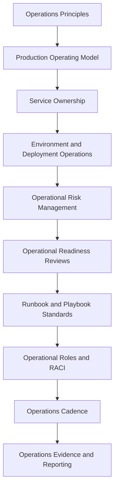

# PART-01 — Operations Foundation

> *"Production is not where software ends. Production is where software begins proving itself."*

---

# Purpose

Part 01 defines CLARA's production operations foundation.

It covers:

- Book VII overview.
- Operations principles.
- Production operating model.
- Service ownership and on-call readiness.
- Environment and deployment operations.
- Operational risk management.
- Operational readiness reviews.
- Runbook and playbook standards.
- Operational roles and RACI.
- Operations cadence and review rhythm.
- Operations evidence and reporting.

---

# Chapter Map

| Chapter | Title |
|---:|---|
| 01 | Book VII Overview |
| 02 | Operations Principles |
| 03 | Production Operating Model |
| 04 | Service Ownership and On-Call Readiness |
| 05 | Environment and Deployment Operations |
| 06 | Operational Risk Management |
| 07 | Operational Readiness Reviews |
| 08 | Runbook and Playbook Standards |
| 09 | Operational Roles and RACI |
| 10 | Operations Cadence and Review Rhythm |
| 11 | Operations Evidence and Reporting |
| 12 | Part 01 Summary |

---

# Book VII Scope

Book VII defines how CLARA runs in production:

```text
operations model
observability
logging
metrics
alerts
incident operations
reliability engineering
performance and capacity
backup and restore
production support
runbooks and playbooks
SLOs/SLIs/error budgets
operational security
operations handover
```

---

# Operations Foundation Map



---

# Relationship to Book VI

Book VI defines security, governance, and compliance.

Book VII operationalizes production reliability:

```text
Book VI asks: Is this governed and secure?
Book VII asks: Can this run, be observed, be supported, and be recovered in production?
```

---

# Navigation

**Previous:** `../BOOK-06-Security-Governance-and-Compliance/BOOK-06-Master-Index/BOOK-06-NEXT-STEPS.md`

**Next:** `01-Book-VII-Overview.md`
