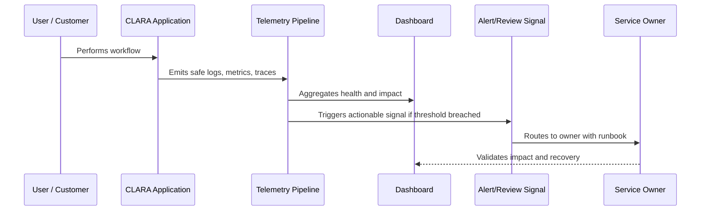

# Observability Strategy Overview

> *"Introduces CLARA's observability strategy for understanding production behavior, user impact, reliability, performance, AI behavior, integration health, and operational risk."*

---

# Purpose

Introduces CLARA's observability strategy for understanding production behavior, user impact, reliability, performance, AI behavior, integration health, and operational risk.

---

# Operational Problem

Without observability, production incidents become guessing games and customer impact is discovered too late.

---

# Operational Decision

## Decision

CLARA should build observability as an engineering capability that helps teams detect, explain, recover, and improve production behavior.

## Status

Accepted.

---

# Observability Rule

Every important CLARA capability must define:

```text
Capability -> Owner -> User Impact Signal -> Logs -> Metrics -> Trace/Correlation -> Dashboard -> Alert/Review Path -> Runbook
```

Observability should help teams answer:

```text
is it working
who is affected
where is it failing
why is it failing
how bad is it
what changed
how to recover
how to prevent recurrence
```

---

# Recommended Observability Flow



---

# Production-Ready Checklist

- [ ] User-impact signal is defined.
- [ ] Owner is assigned.
- [ ] Logs are structured and safe.
- [ ] Metrics are defined.
- [ ] Trace/correlation ID is propagated.
- [ ] Dashboard exists or is planned.
- [ ] Alert/review signal is actionable.
- [ ] Runbook is linked.
- [ ] Telemetry access is permission-controlled.
- [ ] Sensitive data is redacted/minimized.

---

# Acceptance Criteria

- [ ] Observability goal is clear.
- [ ] Telemetry sources are clear.
- [ ] User-impact mapping is clear.
- [ ] Dashboard and alert expectations are clear.
- [ ] Security/privacy boundaries are clear.
- [ ] Operational owner can act on the signal.
- [ ] AI coding assistants can follow this safely.

---

# Anti-patterns

Avoid:

- Logging full customer messages by default.
- Logging secrets, tokens, API keys, or credentials.
- Dashboards with no owner.
- Alerts without runbooks.
- Metrics that do not connect to user impact.
- No correlation ID across async jobs.
- Only monitoring infrastructure and not product workflows.
- Treating AI/integration observability as optional.
- Keeping noisy alerts that everyone ignores.
- Storing telemetry forever without retention decision.

---

# Related Documents

- ../PART-01-Operations-Foundation/README.md
- ../../BOOK-06-Security-Governance-and-Compliance/PART-07-Audit-Evidence-and-Compliance-Readiness/README.md
- ../../BOOK-06-Security-Governance-and-Compliance/PART-08-Incident-Response-and-Business-Continuity-Governance/README.md
- ../../BOOK-06-Security-Governance-and-Compliance/PART-05-AI-Governance-and-Model-Risk/README.md
- ../../BOOK-06-Security-Governance-and-Compliance/PART-06-Integration-and-Third-Party-Governance/README.md

---

# Navigation

**Previous:** `../PART-01-Operations-Foundation/12-Part-01-Summary.md`

**Next:** `14-Observability-Principles.md`

---

# Observability Scope

CLARA observability covers:

```text
frontend user workflows
backend APIs
database operations
queue/worker jobs
AI Gateway calls
RAG/context building
integration webhooks
outbound delivery
file/attachment operations
authentication/session flow
audit logging pipeline
deployment/release events
```

---

# Core Observability Questions

```text
Can we detect a failure?
Can we localize the failure?
Can we measure customer impact?
Can we correlate logs across systems?
Can we see what changed?
Can we recover quickly?
Can we prove what happened later?
```

---

# Observability Maturity Path

```text
basic logs
structured logs
metrics and dashboards
actionable alerts
distributed tracing
user-impact observability
AI/integration observability
SLO/error-budget driven operations
```
