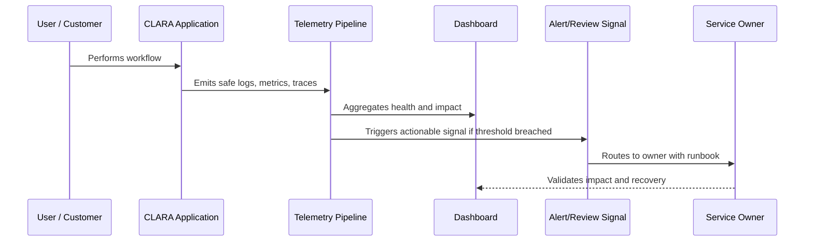
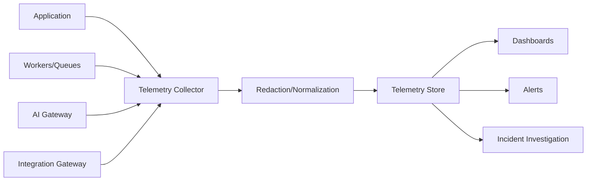

# Telemetry Architecture

> *"Defines the architecture for collecting, processing, storing, querying, and acting on CLARA telemetry."*

---

# Purpose

Defines the architecture for collecting, processing, storing, querying, and acting on CLARA telemetry.

---

# Operational Problem

Fragmented telemetry makes incidents hard to investigate and creates inconsistent operational visibility.

---

# Operational Decision

## Decision

CLARA telemetry should flow through a consistent architecture that preserves context, avoids sensitive data leakage, and supports operational decisions.

## Status

Accepted.

---

# Observability Rule

Every important CLARA capability must define:

```text
Capability -> Owner -> User Impact Signal -> Logs -> Metrics -> Trace/Correlation -> Dashboard -> Alert/Review Path -> Runbook
```

Observability should help teams answer:

```text
is it working
who is affected
where is it failing
why is it failing
how bad is it
what changed
how to recover
how to prevent recurrence
```

---

# Recommended Observability Flow



---

# Production-Ready Checklist

- [ ] User-impact signal is defined.
- [ ] Owner is assigned.
- [ ] Logs are structured and safe.
- [ ] Metrics are defined.
- [ ] Trace/correlation ID is propagated.
- [ ] Dashboard exists or is planned.
- [ ] Alert/review signal is actionable.
- [ ] Runbook is linked.
- [ ] Telemetry access is permission-controlled.
- [ ] Sensitive data is redacted/minimized.

---

# Acceptance Criteria

- [ ] Observability goal is clear.
- [ ] Telemetry sources are clear.
- [ ] User-impact mapping is clear.
- [ ] Dashboard and alert expectations are clear.
- [ ] Security/privacy boundaries are clear.
- [ ] Operational owner can act on the signal.
- [ ] AI coding assistants can follow this safely.

---

# Anti-patterns

Avoid:

- Logging full customer messages by default.
- Logging secrets, tokens, API keys, or credentials.
- Dashboards with no owner.
- Alerts without runbooks.
- Metrics that do not connect to user impact.
- No correlation ID across async jobs.
- Only monitoring infrastructure and not product workflows.
- Treating AI/integration observability as optional.
- Keeping noisy alerts that everyone ignores.
- Storing telemetry forever without retention decision.

---

# Related Documents

- ../PART-01-Operations-Foundation/README.md
- ../../BOOK-06-Security-Governance-and-Compliance/PART-07-Audit-Evidence-and-Compliance-Readiness/README.md
- ../../BOOK-06-Security-Governance-and-Compliance/PART-08-Incident-Response-and-Business-Continuity-Governance/README.md
- ../../BOOK-06-Security-Governance-and-Compliance/PART-05-AI-Governance-and-Model-Risk/README.md
- ../../BOOK-06-Security-Governance-and-Compliance/PART-06-Integration-and-Third-Party-Governance/README.md

---

# Navigation

**Previous:** `14-Observability-Principles.md`

**Next:** `16-Logs-Metrics-and-Traces-Strategy.md`

---

# Telemetry Pipeline

A production-ready telemetry pipeline includes:

```text
instrumentation
collection
normalization
redaction
correlation
storage
querying
dashboards
alerts
retention
access control
```

---

# Architecture Sketch



---

# Telemetry Ownership

Every telemetry stream should define:

```text
source
owner
purpose
sensitivity
retention
access level
dashboard/alert usage
```
